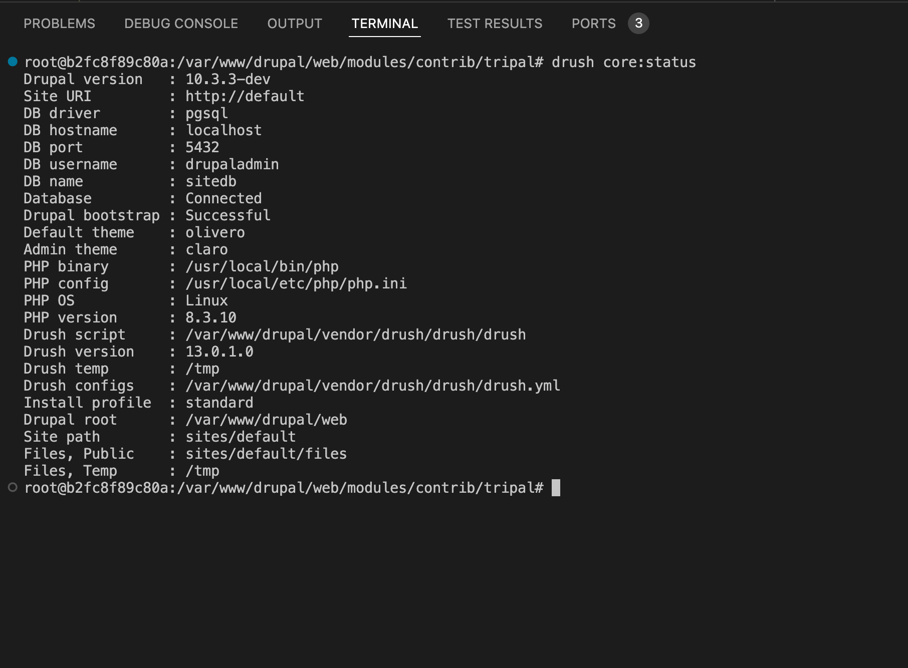
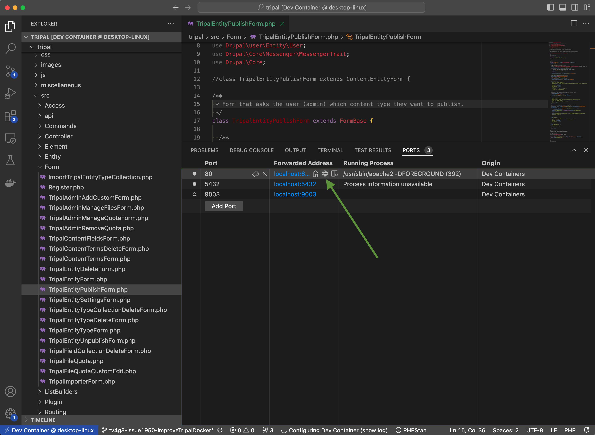
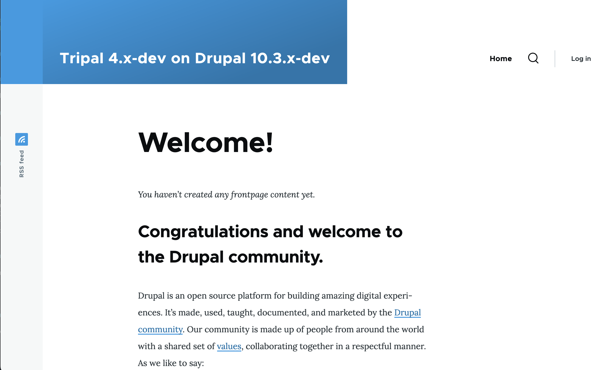
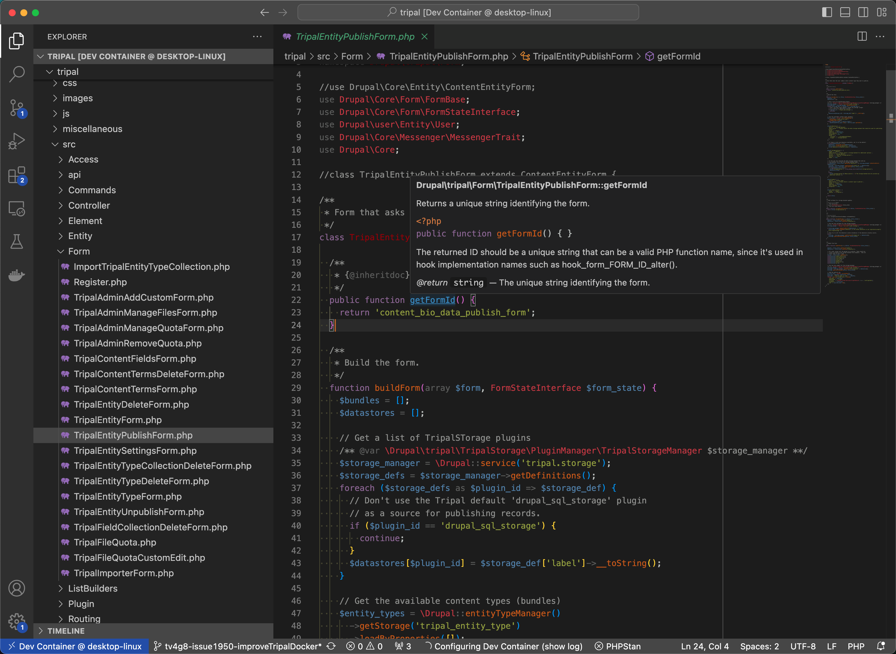
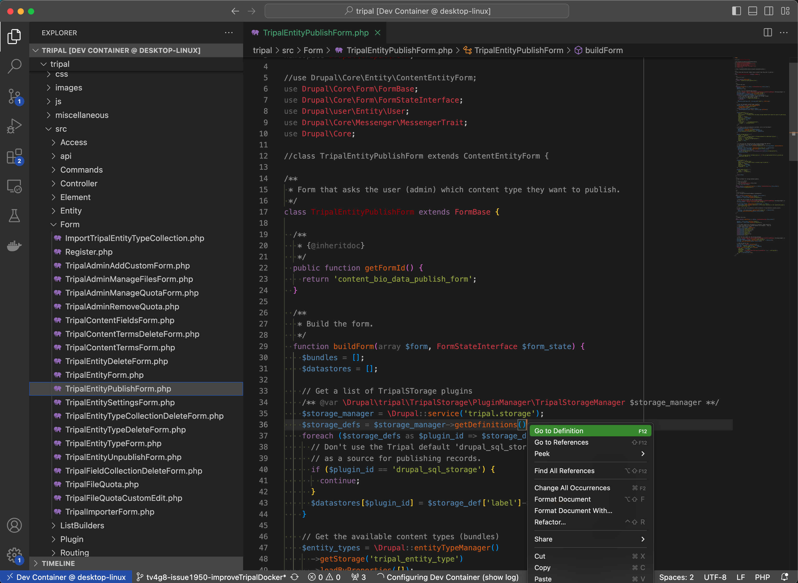
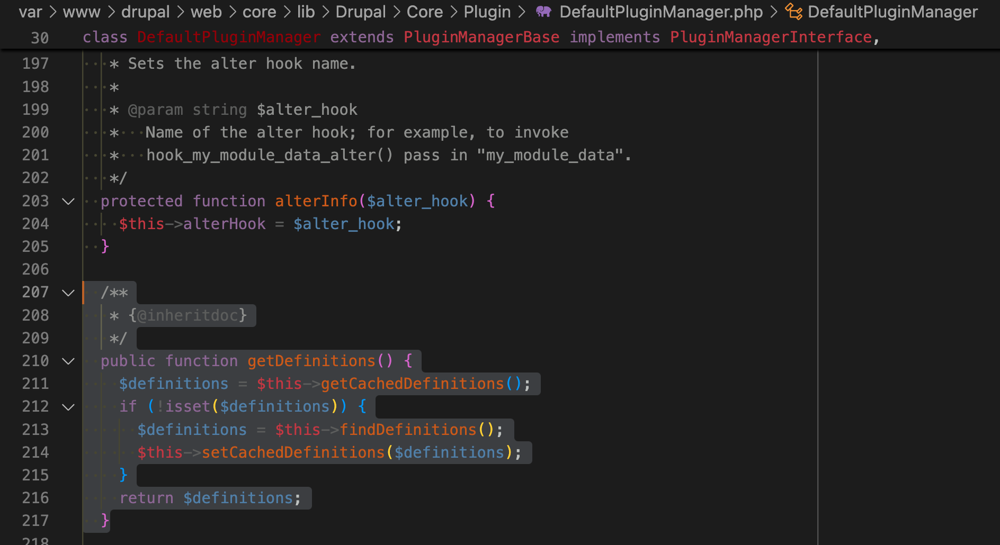
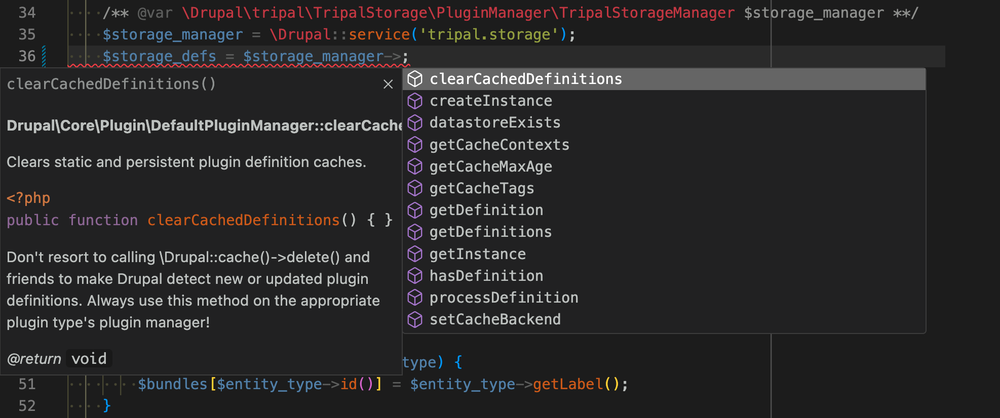

Using VSCode when developing for Tripal
==========================================

In addition to using docker directly when testing or developing for Tripal, we also have built in integration with VSCode to make your life that little bit easier! More specifically, we integrate with `VSCode DevContainers <https://code.visualstudio.com/docs/devcontainers/containers>`_ via the devcontainer.json file in the root of this repository. This allows VSCode to automatically

1. Build a docker image based on our Dockerfile
2. Start a container using that image
3. Mount your current local directory inside the container
4. Configure VScode to seamlessly integrate with the container so that Devcontainer enabled extensions use the container directly. For example, opening the terminal will open a bash session directly in the container in your mounted tripal directory.
5. Install and configure a number really helpful VSCode extensions to make your life easier including php intelephense (php syntax checking and autocomplete), Drupal specific autocomplete, code standards checking, phpunit testing integration, etc. (see more below)

Dev Container: Requirements
---------------------------

1. Visual Studio Code with the Microsoft Dev Containers extension (`ms-vscode-remote.remote-containers`).
2. Docker installed locally. We suggest Docker Desktop for Mac and Windows machines.

Dev Container: Usage
---------------------

1. Clone the Tripal repository locally and open it in VSCode.
2. You should see a popup in the bottom right corner that lets you know the folder contains a Dev Container configuration file. You should click on "Reopen in Container" which will build a docker image based on the dockerfile in your local Tripal clone, start a container and configure VScode based on the devcontainer.json file. This will take a bit of time.

  .. image:: vscode.devcontainer.notification.png

  You will see a "Configuring DevContainer (show log)" notification. The log will show you the docker build progress and upon completion prints out the site admin login information.

  When it's complete, you will see the DevContainer status in the bottom left corner which indicates you are using "Dev Container @ TripalDocker".

3. If you don't see the popup above, you can instead click on the Dev Container status icon in the bottom left corner. This will open the command palette where you can choose "Reopen in Container".

  .. image:: vscode.devcontainer.statusIcon.png

  .. image:: vscode.devcontainer.commandpalette.png

Tour of Devcontainer Features/Benefits
---------------------------------------

Terminal mounts inside container
^^^^^^^^^^^^^^^^^^^^^^^^^^^^^^^^^

In VSCode, go to Terminal in the top menu bar and click "New Terminal". This will open a terminal inside the container which allows you to use Drush natively without the need for "docker exec" or any other command prefixes!

Ports automatically mapped
^^^^^^^^^^^^^^^^^^^^^^^^^^^

Ports exposed via the dockerfile are now mapped automatically to ports on your local machine. This allows you to have multiple devcontainers open without having to think about ports at all.

To view your Drupal site, go to "Ports", hoveer over the forwarded address for port 80 which runs the webserver and then click on the little globe icon. This will open the Drupal homepage in your default web browser. Note the login information was printed to the terminal during devcontainer startup *winks*.

PHP Code intellegence
^^^^^^^^^^^^^^^^^^^^^^

This is provided by the `PHP Intelephense (bmewburn.vscode-intelephense-client) <https://marketplace.visualstudio.com/items?itemName=bmewburn.vscode-intelephense-client>`_ extension.

While it does have a premium version, we use the free version which includes the following:

 - Fast camel/underscore case code completion (IntelliSense) for document, workspace and built-in symbols and keywords with automatic addition of use declarations.
 - Detailed signature (parameter) help for document, workspace and built-in constructors, methods, and functions.
 - Rapid workspace wide go to definition support.
 - Workspace wide find all references.
 - Fast camel/underscore case workspace symbol search.
 - Full document symbol search that also powers breadcrumbs and outline UI.
 - Multiple diagnostics for open files via an error tolerant parser and powerful static analysis engine.
 - Lossless PSR-12 compatible document/range formatting. Formats combined HTML/PHP/JS/CSS files too.
 - Embedded HTML/JS/CSS code intelligence.
 - Detailed hover with links to official PHP documentation.
 - Smart highlight of references and keywords.
 - Advanced PHPDoc type system supporting templates and callable signatures.
 - Reads PHPStorm metadata for improved type analysis and suggestions.

**Hover over a method name to get the full documentation header for it.**

In the screenshot below we simply hovered over the "getFormId()" method and the full documentation from the Drupal API automatically popped up describing it's function, parameters and return value.

**Right click on a method name to jump to its definition.**

In the screenshot below we right clicked on the "getDefinitions" method and then chose "Go to Definition". This actually opens the Drupal class file which is outside of the current workspace that contains this method and scrolls to it as shown in the second screenshot!

**Code Completion based on the entire Drupal + Tripal codebases!**

When you are developing you will have autocompletes based on the entire Drupal + Tripal codebases. For example, in the following screenshot we create a new tripal.storage service object on line 35 and then on line 36, we are offered a list of all the methods available in that service as we type! Furthermore, hovering over the options shows you the method definitions so you can choose the right one.

