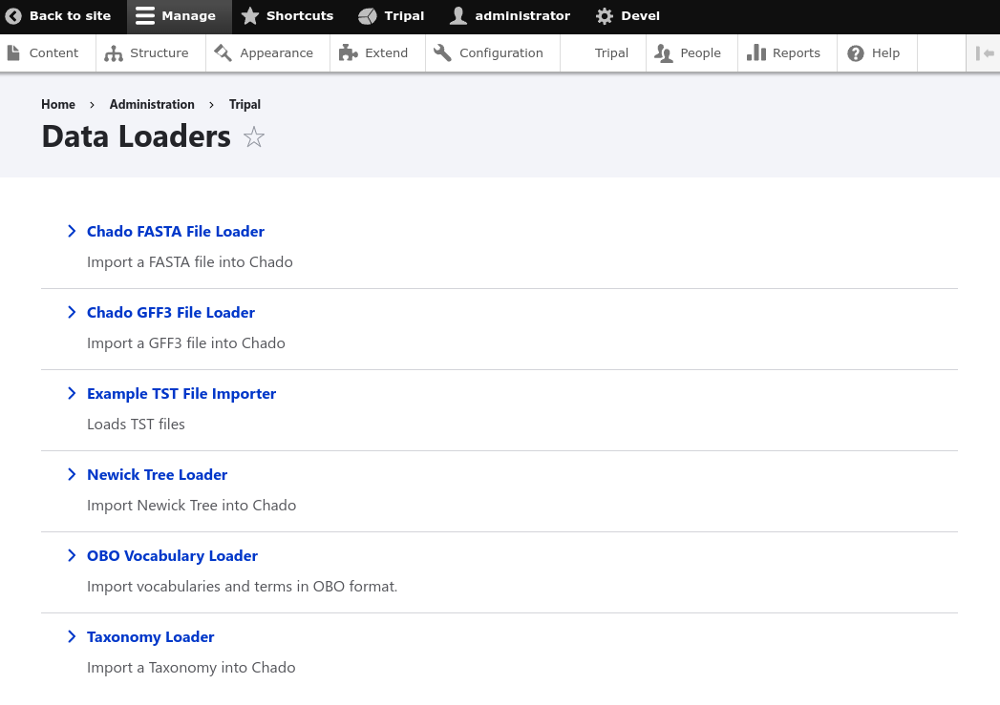
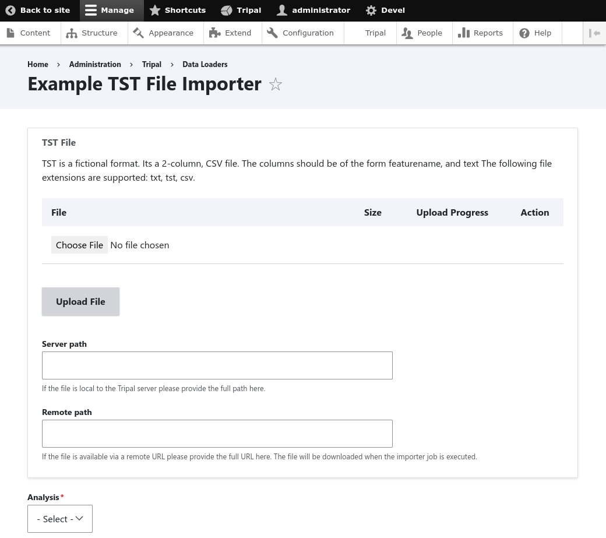
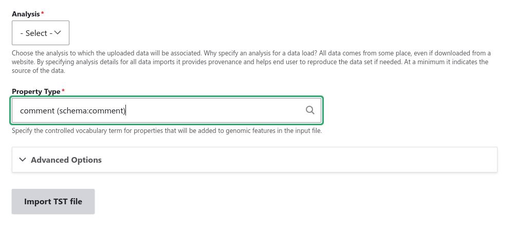

Creating a Chado Data Importer
==============================
Often we want to provide a user interface by which a site developer can easily import data into Chado. Examples of existing loaders compatible with Tripal include the FASTA and GFF3 loaders that come with the Tripal Genome module.  These loaders allow users to import data into Chado that are in `FASTA <https://en.wikipedia.org/wiki/FASTA_format>`_ or `GFF3 format <https://github.com/The-Sequence-Ontology/Specifications/blob/master/gff3.md>`_.  

If you would like to create a new data importer for Chado you will need to create your own **TripalImporter** plugin.  The Tripal importers use the `Drupal Plugin API <https://www.drupal.org/docs/drupal-apis/plugin-api/plugin-api-overview>`_. The plugin infrastructure of Drupal allows a module to provide new functionality that builds off of a common interface. For importing data this interface is provided by the ``TripalImporterInterface`` class.   The **TripalImporter** plugin provides many conveniences. For example, it provides an input form that automatically handles files uploads, it performs job submission, logging, and provides progress updates during execution. Adding a **TripalImporter** plugin to your module will allow anyone who installs your module to also use your new loader!

Here, we will show how to create a **TripalImporter** plugin by building a simple importer called the **ExampleImporter**. This importer reads a comma-separated file containing genomic features and their properties (a fictional "Test Format" file).  The loader will split each line into feature and property values, and then insert each property into the ``featureprop`` table of Chado using a controlled vocabulary term (supplied by the user) as the ``type_id`` for the property.

.. note::
  Prior to starting your data loader you should plan how the data will be imported into Chado. Chado is a flexible database schema and it may be challenging at times to decide in to which tables data should be placed.  It is recommended to reach out to the Chado community to solicit advice. Doing so will allow you to share your loader will other Tripal users more easily!

Step 1: Create Your Module
--------------------------
To create your an importer, you first need to have a Drupal module in which the loader will be provided.  If you do not know how to create a module, see the section titled :doc:`../module_dev` for further direction. For this document we will describe creation of an importer in a fake module named ``tripal_example_importer``.

Step 2: Create the Importer Class File
--------------------------------------
To define a new ``TripalImporter`` plugin, you should first create the directory ``src/Plugin/TripalImporter/`` in your module. For the example here, we will create a new plugin named ``ExampleImporter``. We must name the file the same as the class (with a ``.php`` extension) and place the file in the ``src/Plugin/TripalImporter/`` directory we just created. For example: ``tripal_example_importer\src\Plugin\TripalImporter\ExampleImporter.inc``.    Placing the importer class file in the ``src/Plugin/TripalImporter`` directory is all you need for Tripal to find it. Tripal will automatically place a link for your importer on the Drupal site at **admin > Tripal > Data Loaders**.

Step 3: Stub the Class File
---------------------------

In the Class file created in the previous step we will write our **TripalImporter** plugin. First, we must set the namespace for this class. It should look similar to the path where the file is stored (but without the ``src`` directory):

.. code-block:: php

  <?php
  namespace Drupal\tripal_example_importer\Plugin\TripalImporter;

Next, an importer that is meant to load data into Chado should extend the  ``ChadoImporterBase`` class. 

.. code-block:: php

  <?php
  namespace Drupal\tripal_example_importer\Plugin\TripalImporter;

  use Drupal\tripal_chado\TripalImporter\ChadoImporterBase;

  class ExampleImporter extends ChadoImporterBase {

All **TripalImporter** plugins uss the ``TripalImporterInterface`` which requires that several unctions are included in your plugin. These functions are:

- ``form()``
- ``formSubmit()``
- ``formValidate()``
- ``run()``
- ``postRun()``

We will discuss each fucntion later but for now, we will create "stubs" for each of these functions in our class. For our example empty class it should look like the following:

.. code-block:: php

  <?php
  namespace Drupal\tripal_example_importer\Plugin\TripalImporter;

  use Drupal\tripal_chado\TripalImporter\ChadoImporterBase;

  class ExampleImporter extends ChadoImporterBase {

  
    /**
     * @see ChadoImporterBase::form()
     */
    public function form($form, &$form_state) {

      // Always call the parent form.
      $form = parent::form($form, $form_state);

      return $form;
    }

    /**
     * @see ChadoImporterBase::formSubmit()
     */
    public function formSubmit($form, &$form_state) {
    
    }

    /**
     * @see ChadoImporterBase::formValidate()
     */

    public function formValidate($form, &$form_state) {
    
    }

    /**
     * @see ChadoImporterBase::run()
     */
    public function run() {
    
    }

    /**
     * @see ChadoImporterBase::postRun()
     */
    public function postRun() {
    
    }
  }

Notice in the ``form()`` function there is a call to the ``parent::form()``:

.. code-block:: php

    /**
     * @see ChadoImporterBase::form()
     */
    public function form($form, &$form_state) {

      // Always call the parent form.
      $form = parent::form($form, $form_state);

      return $form;
    }

Without calling the ``parent::form()`` function your importer's form may not properly work.  This is required.

Step 4: Add Class Annotations
-----------------------------
All Drupal plugins require an `Annotation section <https://www.drupal.org/docs/drupal-apis/plugin-api/annotations-based-plugins>`_ that appears as a PHP comment just above the Class definition. The annotation section provides settings that the **TripalImporter** plugin requires.  As a quick example here is the Annotation section for the GFF3 importer. The GFF3 importer is provided by the Tripal Genome module and imports features defined in a GFF3 file into Chado.

.. code-block:: php

  /**
  *  GFF3 Importer implementation of the ChadoImporterBase.
  *
  *  @TripalImporter(
  *    id = "chado_fasta_loader",
  *    label = @Translation("Chado FASTA File Loader"),
  *    description = @Translation("Import a FASTA file into Chado"),
  *    file_types = {"fasta","txt","fa","aa","pep","nuc","faa","fna"},
  *    upload_description = @Translation("Please provide a plain text file following the <a target='_blank' href='https://en.wikipedia.org/wiki/FASTA_format'>FASTA format specification</a>."),
  *    upload_title = @Translation("FASTA File"),
  *    use_analysis = True,
  *    require_analysis = True,
  *    use_button = True,
  *    button_text = @Translation("Import FASTA file"),
  *    file_upload = True,
  *    file_remote = True,
  *    file_local = True,
  *    file_required = True,
  *    submit_disabled = False
  *  )
  */
  class GFF3Importer extends ChadoImporterBase {

In the code above, the annotation section consists of multiple settings in key/value pairs.  The meaning of each settings is as follows:

- ``id``: A unique machine readable plugin ID for the loader. It must only contain alphanumeric characters and the underscore. It should be lowercase.  
- ``label``: the human readable name (or label) for this importer. It is wrapped in a ``@Translation()`` function which will allow Drupal to provide translations for it.  This label is shown to the user in the list of available data importers.
- ``description``: A short description for the site user that briefly indicates what this loader is for. It too is wrapped in a ``@Translation()``  function.  This description is shown to the user for the loader.
- ``file_types``: A list of file extensions that the importer will allow to be uploaded. If a file does not have an extension in the list then it cannot be uploaded by the importer.
- ``upload_title``:  Provides the title that should appear above the upload button.  This helps the user understand what type of file is expected.
- ``upload_description``: Provides the information for the user related to the file upload. You can provide additional instructions or help text.
- ``use_analysis``:  To support FAIR data principles, we should ensure that provenance of data is available. Chado provides the ``analysis`` table to link data to an analysis.  The analysis record provides the details for how the data in the file was created or obtained. Set this to ``False`` if the loader should not require an analysis when loading. if ``use_analysis`` is set to ``True`` then the user will be presented with a form element to select an analysis and this analysis will be available to you for your importer.
- ``require_analysis``:  If the ``use_analysis`` value is set then this value indicates if the analysis should be required. If ``True`` it will be required, otherwise it will be optional.
- ``button_text``: The text that should appear on the button at the bottom of the importer form.
- ``use_button``: Indicates whether a submit button should be present. This should only be ``False`` in situations were you need multiple buttons or greater control over the submit process (e.g., multi-page forms).
- ``submit_disabled``: Indicates whether the submit button should be disabled when the form appears. The form can then be programmatically enabled via AJAX once certain criteria is set.
- ``file_upload``: Indicates if the loader should provide a form element for uploading a file.
- ``file_remote``: Indicates if the loader should provide a form element for specifying the URL of a remote file.
- ``file_local``: Indicates if the loader should provide a form element for specifying the path available to the web server where the file is located.
- ``file_required``:  Indicates if the file must be provided. 

For our ``ExampleImporter`` class we will set the annotations accordingly:

.. code-block:: php

  /**
    *  TST Importer implementation of the ChadoImporterBase.
    *
    *  @TripalImporter(
    *    id = "tripal_tst_loader",
    *    label = @Translation("Example TST File Importer"),
    *    description = @Translation("Loads TST files"),
    *    file_types = {"txt", "tst", "csv"},
    *    upload_description = @Translation("TST is a fictional format.  Its a 2-column, CSV file.  The columns should be of the form featurename, and text"),
    *    upload_title = @Translation("TST File"),
    *    use_analysis = True,
    *    require_analysis = True,
    *    use_button = True,
    *    button_text = @Translation("Import TST file"),
    *    file_upload = True,
    *    file_remote = True,
    *    file_local = True,
    *    file_required = True,
    *    submit_disabled = False
    *  )
    */
    class ExampleImporter extends ChadoImporterBase {

.. warning::

  You must use double quotes when specifying strings in the Annotations.

Step 5: Check Availability
--------------------------
Now that we have created the plugin and set it's annotations it should appear in the list of Tripal Importers at **admin > Tripal > Data Loaders** after we clear the Drupal cache (``drush cr``). 

.. note::

  If your importer does not show in the list of data loaders, check the Drupal recent logs at **admin > Manage > Reports > Recent log messages** .

Using the annotation settings we provided, the importer form will automatically provide a **File Upload** field set, and an **Analysis** selector.  The **File Upload** section lets users choose to upload a file, provide a server path to a file already on the web server or a specify a remote path for files located via a downloadable link on the web.  The **Analysis** selector is important because it allows the user to specify an analysis that describes how the data file was created. It will look like the following screenshot:

Step 6: Customize the Form
--------------------------

Most likely, you will want to add elements the importer form. For our example TST file importer we want to split the file to retrieve feature and their properties, and then insert properties into the ``featureprop`` table of Chado. That table requires a controlled vocabulary term ID for the ``type_id`` column of the table. Therefore, we want to customize the importer form to request a controlled vocabulary term. To customize the form we can use three functions:

- ``form()``:  Allows you to add additional form elements to the form.
- ``formValidate()``:  Provides a mechanism by which you can validate the form elements you added.
- ``formSubmit()``: Allows you to perform some preprocessing prior to submission of the form. Typically this function does not need to be implemented--only if you want to do preprocessing before submission.

.. note::

  If you are not familiar with form creation in Drupal you may want to find a Drupal reference book that provides step-by-step instructions.  Additionally, you can explore the `API documentation for form construction for Drupal 10 <https://www.drupal.org/docs/drupal-apis/form-api>`_.  

The form() function
^^^^^^^^^^^^^^^^^^^

We can use the ``form()`` function to add the element to request the property CV term. To help, Tripal provides a handy service for searching for a controlled vocabulary term, we can use this as part of a text box with an autocomplete.  The following code shows the addition of a new ``textfield`` form element with a ``#autocomplete_route_name`` setting that tells the form to use Tripal's CV search service to support autocompletion as the user types.

.. code-block:: php
  :name: ExampleImporter::form

  public function form($form, &$form_state) {

    // Always call the parent form.
    $form = parent::form($form, $form_state);

    // Add an element to the form to allow a user to pick
    // a controlled vocabulary term.
    $form['pick_cvterm'] = [
      '#title' => t('Property Type'),
      '#type' => 'textfield',
      '#required' => TRUE,
      '#description' => t("Specify the controlled vocabulary term for "
        . "properties that will be added to genomic features in the input file."),
      '#autocomplete_route_name' => 'tripal_chado.cvterm_autocomplete',
      '#autocomplete_route_parameters' => ['count' => 5, 'cv_id' => 0],
    ];

    return $form;
  }

The ``#autocomplete_route_parameters`` setting takes an array of two arguments: ``count`` and ``cv_id``.  The ``count`` argument specifies the maximum number of matching CV terms that will be shown as the user types.  The ``cv_id`` in the example is set to zero, indicating that there are no restrictions on which vocabulary the terms can come from. If you wanted to restrict the user to only selecting terms from a specific vocabulary then you would set the ``cv_id`` to the vocabulary ID from Chado.

Reloading the importer, the form now has an autocomplete text box for selecting a CV term.

The formValidate() function
^^^^^^^^^^^^^^^^^^^^^^^^^^^
The ``formValidate()`` function is responsible for verifying that the user supplied values are valid.  This function receives two arguments: ``$form`` and ``$form_validate``.  The ``$form`` object contains the fully built form.  The ``$form_validate`` argument contains the object that represents the user submitted state of the form. To warn the user of inappropriate values, the ``$form_state->setErrorByName()`` function is used. It provides an error message, highlights in red the widget containing the bad value, and prevents the form from being submitted--allowing the user to make corrections. In our example code, we will check that the user selected a CV term from the ``pick_cvterm`` widget.

.. code-block:: php

  public function formValidate($form, &$form_state) {

    // Get the values submitted by the user.
    $form_state_values = $form_state->getValues();

    // The pick_cvterm element is required and Drupal will handle that
    // check for us, so we only need to make sure the user let the user selected
    // a term from the autocomplete with the accession in parentheses.
    $term = $form_state_values['pick_cvterm'];

    if (!preg_match('/\(.+?:.+?\)/', $term)) {
      $form_state->setErrorByName('pick_cvterm',
        t('Please choose a property type from the list that appears while typing. '
          . 'It must include the controlled vocabulary term accession'));
    }
  }

The implementation above gets the ``pick_cvterm`` element from the ``$form_state`` object. The PHP ``preg_match`` function uses a regular expression to make sure the term selected by the user has the format provided by the autocomplete (e.g., `comment (rdfs:comment)`). It checks to make sure the term accession is present in parentheses. For your importer, use this function to check as many form elements as you add to the importer.

The formSubmit() function
^^^^^^^^^^^^^^^^^^^^^^^^^
If you need to perform any steps prior to running the importer you can use the ``formSubmit()`` function.  Suppose we wanted to add to our form the ability for a user to add new terms that do not already exist in the database.  We would create the form elements in the ``form()`` function, make sure we have validation checks in the ``formValidate()`` and then we could insert the new term into the database prior to job submission in the ``formSubmit()`` function.  Most likely you will not need to use this function. For most existing importers provided by Tripal this function is not used.

Step 7:  Write Importing Code
-----------------------------
When an importer form is submitted and passes all validation checks, a job is automatically added to the :doc:`../../admin_guide/jobs`  system. The ``TripalImporter`` parent class does this for us! The :doc:`../../admin_guide/jobs` system is meant to allow long-running jobs to execute behind-the-scenes on a regular time schedule.  As jobs are added they are executed in order.  Therefore, if a user submits a job using the importer's form then the :doc:`../../admin_guide/jobs`  system will automatically run the job the next time it is scheduled to run or it can be launched manually by the site administrator.

When the **Tripal Job** system executes an importer job it will call three different functions:

- ``preRun()``: contains code to be executed prior to the the ``run()`` function.
- ``run()``: contains the code that performs the import of the file.
- ``postRun()``: contains code to be executed after executiong of the ``run()` function.

These functions were added to our class as "stubs" in Step 3 above and now we discuss each of these.

The preRun() function
^^^^^^^^^^^^^^^^^^^^^
The ``preRun()`` function is called automatically by Tripal and should contain code that must be executed prior to running hte importer.  This function provide any setup that is needed prior to importing the file.  In the case of our example importer, we will not need to use the ``preRun()`` function so it will remain empty.

The run() function
^^^^^^^^^^^^^^^^^^
The ``run()`` function is called automatically when Tripal runs the importer. For our ``ExampleImporter``, the run function should read and parse the input file and load the data into Chado. The first step, is to retrieve the user provided values from the form and the file details. The inline comments in the code below provide instructions for retrieving these details.

.. code-block:: php

    public function run() {

      // All values provided by the user in the Importer's form widgets are
      // made available to us here by the Class' arguments member variable.
      $arguments = $this->arguments['run_args'];

      // The path to the uploaded file is always made available using the
      // 'files' argument. The importer can support multiple files, therefore
      // this is an array of files, where each has a 'file_path' key specifying
      // where the file is located on the server.
      $file_path = $this->arguments['files'][0]['file_path'];

      // The analysis that the data being imported is associated with is always
      // provided as an argument.
      $analysis_id = $arguments['analysis_id'];

      // Convert the cvterm text provided by the user submitted form
      // to the actual cvterm ID from chado.
      $cvterm = $arguments['pick_cvterm'];
      $cv_autocomplete = new ChadoCVTermAutocompleteController();
      $cvterm_id = $cv_autocomplete->getCVtermId($cvterm);

      // Now that we have our file path, analysis_id and CV term we can load
      // the file.  We'll do so by creating a new function in our class
      // called "loadMyFile" and pass these arguments to it.
      $this->loadMyFile($analysis_id, $file_path, $cvterm_id);
    }

In the example code above the ``loadMyFile()`` function is a function we add to our importer class that completes the loading of the file.  We do not show the code of that function here, but it will be responsible for reading in the file provided by the ``$file_path`` variable and import the feature properties into Chado. 

Logging 
^^^^^^^
During execution of our importer it is often useful to inform the user of progress, status and issues encountered. All **TripalImporter** plugins have several built-in objects and functions that support logging and reporting of progress.  For logging, each importer has access to a **TripalLogger** accessible as ``$this->logger`` which uses the `Drupal Logging API <https://www.drupal.org/docs/8/api/logging-api/overview>`_.   There are several functions that you can use with the logger than can report errors, warnings, notices or debugging information.  A quick list of these are:

- ``$this->logger->emergency($message)``
- ``$this->logger->alert($message)``
- ``$this->logger->critical($message)``
- ``$this->logger->error($message)``
- ``$this->logger->warning($message)``
- ``$this->logger->notice($message)``
- ``$this->logger->info($message)``
- ``$this->logger->debug($message)``

For each of the functions above, the ``$message`` argument should contain the text that is reported. The following is an example code from the GFF3 loader where logging is used to report progress of each step:

.. code-block:: php

  $this->logger->notice("Step  1 of 27: Caching GFF3 file...");
  

.. warning::

  Do not use ``print`` or ``print_r`` statements as a way to inform the user of warnings, errors or progress. These will not be logged and may interfere with functional testing.

Throwing errors
^^^^^^^^^^^^^^^
The **TripalImporter** plugins can throw errors if needed.  Tripal will catch the error, perform appropriate logging and recover gracefully.  An example of throwing an error from the GFF3 loader:

.. code-block:: php

    throw new \Exception(t('Cannot find landmark feature type \'%landmark_type\'.',
         ['%landmark_type' => $this->default_landmark_type]));

After an error is caught by Tripal, all database changes will be rolled back and any changes made to the database during the process of running the importer will no longer exist. 

Reporting Progress
^^^^^^^^^^^^^^^^^^
For progress reporting, **TripalImporter** plugins can utilize two different functions:

- ``$this->setTotalItems()``: Indicates the total number of items (or steps) that must be processed for the importer to complete.
- ``$this->setItemsHandled()``: Reports the total number of items that have been handled.

An **item** is an arbitrary term indicating some countable "units" that will be processed by our importer.  This can be lines in a file, bytes in a file, or steps that an importer performs.  To initialize the progress, first set the number of items handled to zero:

.. code-block:: php

    $this->setItemsHandled(0);

Next indicate how many items you plan to process:

.. code-block:: php

    $this->setTotalItems($num_items);

Then, as you process each item in the loader you can rerun the ``setItemsHandled()`` function and update the number of items that have been handled.

Step 8: Write Functional Tests
------------------------------
Functional testing is a critically important component of any software project. You should always strive to write tests for your software to ensure that the software performs as expected and bugs are less likely to enter the code.  Drupal provides `automated testing <https://www.drupal.org/docs/develop/automated-testing>`_ by integrated the ``phpunit`` testing framework. We can create functional tests by utilizing this infrastructure provided by Drupal.

Create the Testing Class
^^^^^^^^^^^^^^^^^^^^^^^^
Tests for **TripalImporters** are Class files that should be placed in the ``tests/src/Kernel/Plugin/TripalImporter`` folder of your module and the file should have the same name as the importer class with a "Test" suffix. For our example importer it would be found in this location ``tripal_example_importer\tests\src\Kernel\Plugin\TripalImporter\ExampleImporterTest.inc``.

The testing class should have the same name as the file and should extend the ``ChadoTestKernelBase``. The following example code shows the empty starter class for our ``ExampleImporterTest`` class:

.. code-block:: php

  namespace Drupal\Tests\tripal_chado\Kernel\Plugin\TripalImporter;

  use Drupal\Core\Url;
  use Drupal\Tests\tripal_chado\Kernel\ChadoTestKernelBase;

  /**
  * Tests the functionality of the ExampleImporter Importer.
  *
  */
  class ExampleImporterTest extends ChadoTestKernelBase {

    /**
     * {@inheritdoc}
     */
    protected function setUp(): void {
      parent::setUp();
    }
    
    /**
     * Tests the importer form.
     */
    public function testImporterForm() {
      
    }

    /**
     * Tests the run function.
     */
    public function testRun() {
    }
  }

During automated testing, a new temporary instance of Drupal is created. Drupal will run each test class and for each test class, the ``setUp()`` function will be run first. Afterwards, all of the functions that have the prefix ``test`` will be executed.  

The setUp() function
^^^^^^^^^^^^^^^^^^^^
The ``setup()`` function allows you to prepare the test Drupal site so that it is ready for the tests that follow.  The following code provides a common set of steps that all **TripalImporters** should use to setup the class for testing:

.. code-block:: php

  /**
   * {@inheritdoc}
   */
  protected function setUp(): void {

    // Always call the parent::setUp function.
    parent::setUp();

    // Ensure we see all logging in tests.
    \Drupal::state()->set('is_a_test_environment', TRUE);

		// Open a connection to Chado. This will ensure we have a properly 
    // prepared Chado database.
		$this->connection = $this->getTestSchema(ChadoTestKernelBase::PREPARE_TEST_CHADO);

    // Ensure we can access file_managed related functionality from Drupal.
    // ... users need access to system.action config?
    $this->installConfig('system');
    // ... managed files are associated with a user.
    $this->installEntitySchema('user');
    // ... Finally the file module + tables itself.
    $this->installEntitySchema('file');
    $this->installSchema('file', ['file_usage']);
  }

In the ``setUp()`` function above, we first allow the parent class to perform its setup functions. Then we ensure the logger messages are set to be captured for testing, Chado is property initialized and the test supports managed files.

The testImporterForm() function
^^^^^^^^^^^^^^^^^^^^^^^^^^^^^^^
For our first, test, we will write code to ensure that the user interface form is working as intended. Here we will test that all of the form elements that out importer added to the form are working as expected. You do not need to write tests for the file uploader nor for the analysis selection element.  The testing of these elements will happen by the parent classes.  Here we only need to test our additions to the form.  

To perform tests, the ``ChadoTestKernelBase`` class automatically provides a set of `PHPUnit assertion functions <https://docs.phpunit.de/en/9.6/assertions.html>`_.  For example, to test a boolean variable is ``True`` you would use the `assertTrue() <https://docs.phpunit.de/en/9.6/assertions.html#asserttrue>`_ function in the following way:

.. code-block:: php

  $this->assertTrue($my_boolean_var, "The variable is not a boolean.");

Note that the assertion functions are available in your test class a member function (via ``$this->assertTrue()``).  All assertion functions are available in this way. For our example importer we only need to test the property cvterm element.  T

For our example importer, the following code shows how we can test the form:

.. code-block:: php

  /**
   * Tests the importer form.
   */
  public function testImporterForm() {

    // Store the plugin ID and label for easy access later.
		$plugin_id = 'tripal_tst_loader';
    $importer_label = 'Loads TST files';

    // Build the form using the Drupal form builder.
    $form = \Drupal::formBuilder()->getForm('Drupal\tripal\Form\TripalImporterForm',$plugin_id);

    // Ensure we are able to build the form.
    $this->assertIsArray($form, 
      "We expect the form builder to return a form but it did not.");
    $this->assertEquals('tripal_admin_form_tripalimporter', $form['#form_id'], 
      "We did not get the form id we expected.");

    // Now that we have provided a plugin_id, we expect it to have a title matching our importer label.
    $this->assertArrayHasKey('#title', $form, 
      "The form should have a title set.");
    $this->assertEquals($importer_label, $form['#title'], 
      "The title should match the label annotated for our plugin.");
    
    // The plugin_id stored in a value form element.
    $this->assertArrayHasKey('importer_plugin_id', $form, 
      "The form should have an element to save the plugin_id.");
    $this->assertEquals($plugin_id, $form['importer_plugin_id']['#value'], 
      "The importer_plugin_id[#value] should be set to our plugin_id.");
    
    // The form has a submit button.
    $this->assertArrayHasKey('button', $form, 
      "The form should have a submit button since we indicated a specific importer.");

    // Make sure the importer requires an analysis.
    $this->assertArrayHasKey('analysis_id', $form, 
      "The from should not include analysis element, yet one exists.");

    // We should also have our importer-specific form elements added to the form!
    $this->assertArrayHasKey('pick_cvterm', $form,
      "The form should include an the 'pick_cvterm' form element.");

	}

.. error:: 

    The documentation about testing is not yet complete.  More information is needed to describe how to test form submission, the ``run()``, ``preRun()`` and ``postRun()``
