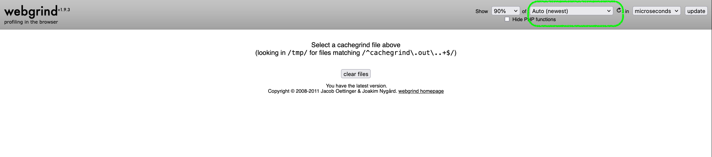

Using XDebug to Profile Performance for a Tripal Site
=======================================================

This lesson describes how to use XDebug to measure the performance of your Tripal site. Specifically, this will show you the complete breakdown of time during the php side of the application for a specific page load.

.. warning::
    This lesson is going to assume you are using TripalDocker which already has XDebug installed and a configuration file focused on profiling. If you are working outside of docker then you will first need to install xdebug and configure it.

    Here is the configuration we use for profiling:

    .. code-block:: ini

      [xdebug]
      xdebug.mode=develop,debug,profile
      xdebug.client_host=host.docker.internal
      xdebug.output_dir=/var/www/drupal/web/modules/contrib/tripal/tripaldocker/xdebug_output
      xdebug.start_with_request=trigger

Create a TripalDocker container
---------------------------------

The following commands should be run on the command-line. The first two lines set up the name of the docker image you want to create the container from and the name of the container. The third line actually creates the container.

.. code-block:: console

  imageName='tripalproject/tripaldocker:latest'
  containerName='tripalPerformance'
  docker run --publish=80:80 --name=$containerName -tid $imageName
  docker exec $containerName service postgresql restart

.. note::
  For more information on setting up TripalDocker, see the section :ref:`Tripal Docker`. For specifics on setting up TripalDocker on PRs, see :ref:`Creating a docker for testing`.

  .. warning::
    The rest of the tutorial assumes there is a variable containerName that indicates the name of the container. If you use different instructions to setup your container, make sure to still set this variable.

Turning on Profiling Mode in TripalDocker
--------------------------------------------

XDebug is installed and configured by default in TripalDocker. However, it is only configured for coverage and debugging by default. That is because there is a substaintial performance hit -especially to PHPUnit- when profiling mode is turned on.

To make things easier, there is a script included in TripalDocker that will toggle the configuration between profile mode enabled and disabled. Since it is disabled by default, we will use this script now to turn on profiling mode.

.. code-block:: console

  docker exec --workdir=/var/www/drupal/web/modules/contrib/tripal $containerName xdebug_toggle.sh

To turn back off profiling when you are done, simple run the above script again.

We also need to ensure the output directory for XDebug exists in the docker. In more recent versions of Tripaldocker this will not be needed.

.. code-block:: console

  docker exec --workdir=/var/www/drupal/web/modules/contrib/tripal $containerName mkdir tripaldocker/xdebug_output
  docker exec --workdir=/var/www/drupal/web/modules/contrib/tripal $containerName chmod a+rw tripaldocker/xdebug_output

Triggering Profiling of a specific page load
----------------------------------------------

There are usually browser extensions available that can trigger Xdebug. That said, it can also be triggered using a get variable and that is the approach we will use in this tutorial.

For example, if you wanted to profile loading of the frontpage of your Tripal site, you would go to the following URL: http://localhost/?XDEBUG_TRIGGER.

While the page is loading, XDebug is profiling the actions taken and saving the information it gleems to the /var/www/drupal/web/modules/contrib/tripal/tripaldocker/xdebug_output directory inside the docker. You can see these by looking inside that directory in the docker:

.. code-block:: console

  docker exec $containerName ls /var/www/drupal/web/modules/contrib/tripal/tripaldocker/xdebug_output

Visualizing the output
-----------------------

Currently the results of your profiling are inside the docker container. However, we would like to bring them into your local directory to visualize them. The following commands will setup a directory to contain all the output files and then copy them from inside the container into your local directory. **Make sure you are in a directory that you want the files saved to. For example, your downloads directory.**

.. code-block:: console

  docker cp $containerName:'/var/www/drupal/web/modules/contrib/tripal/tripaldocker/xdebug_output' ./
  ls xdebug_output

For visualizing these files, we will use Webgrind. Since we already have docker installed, we are going to use another docker container to run webgrind. This way you don't need to install anything!

.. code-block:: console

  docker run --rm -v xdebug_output:/tmp -p 8081:80 jokkedk/webgrind:latest

This will start the webgrind application and make it visible in your browser under port 8081. **Do not quit the open stream after running this command until you want to shut down webgrind!**

Now, go to the following URL in your browser: http://localhost:8081. You should see a screen like the following:

Next, choose one of the webgrind files from the drop-down in the top right corner to visualize it and click update.
