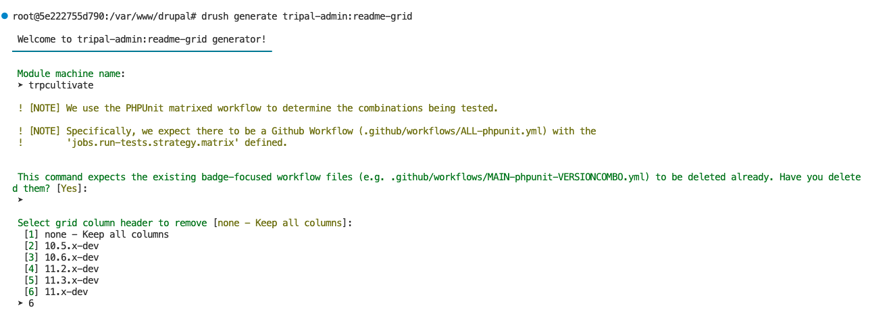
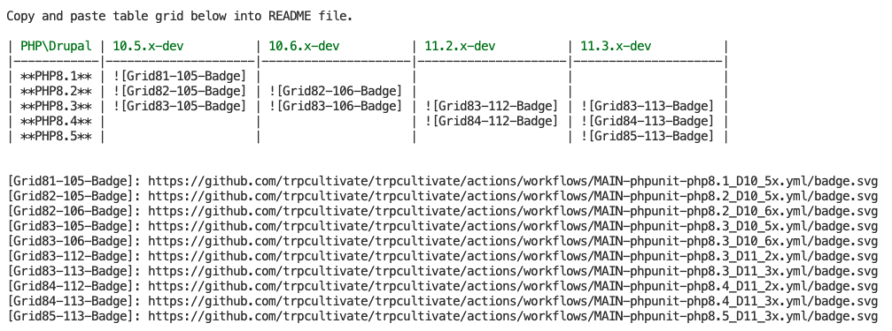

Automated Testing
===================

Tripal 4 is being developed with automated testing as it is upgraded. This greatly improves the stability of our software and our ability to fix any bugs. We highly recommend developing automated testing alongside any extension modules you create! This guide is intended to explain how automated testing is working for Tripal 4 and help you develop similar tests for your extensions.

How run automated tests locally
---------------------------------

See the `Drupal "Running PHPUnit tests" guide <https://www.drupal.org/node/2116263>`_ for instructions on running tests on your local environment. In order to ensure our Tripal functional testing is fully bootstrapped, tests should be run from Drupal core.

If you are using the docker distributed with this module, then you can run tests using:

.. code:: bash

  docker exec --workdir=/var/www/drupal/web/modules/contrib/tripal tripal phpunit

Tripal-focused Testing
------------------------

The following automated testing documentation and tutorials are focused on testing Tripal-specific functionality within Tripal Core and Extension modules. If there is a topic you would like covered that is not yet documented, please add an issue on our github at https://github.com/tripal/tripal_doc/issues!

.. toctree::
   :maxdepth: 2

   testing/tripalTestTrait
   testing/chadoTestTrait
   testing/fields

Automated testing across many Drupal/PHP Versions
------------------------------------------------------
After setting up automated testing with PHPUnit, it is considered best practice to run these tests across all supported Drupal and PHP versions for your module. This guide explains how to configure this using GitHub Workflows, the Tripal Test GitHub Action, and Tripal Devtools.

Creating a GitHub Workflow to test a number of Drupal - PHP - PostgreSQL combinations
^^^^^^^^^^^^^^^^^^^^^^^^^^^^^^^^^^^^^^^^^^^^^^^^^^^^^^^^^^^^^^^^^^^^^^^^^^^^^^^^^^^^^^
1. Copy `.github/workflows/ALL-phpunit.yml <https://github.com/tripal/tripal/blob/4.x/.github/workflows/ALL-phpunit.yml>`_ into your module.
2. Update the `directory-name <https://github.com/tripal/tripal/blob/4.x/.github/workflows/ALL-phpunit.yml#L84>`_ to match the name of the directory in ``/var/www/drupal/web/modules/contrib`` that your module code will be in.
3. If your Dockerfile already enables the modules then `modules <https://github.com/tripal/tripal/blob/4.x/.github/workflows/ALL-phpunit.yml#L85>`_ can be left empty. If not, you can list the modules to be installed here.

And that's it! For more information about the parameters, see the `Tripal Test GitHub Action <https://github.com/tripal/test-tripal-action>`_ documentation.

Generating a testing grid for your readme to show the current compatibility
^^^^^^^^^^^^^^^^^^^^^^^^^^^^^^^^^^^^^^^^^^^^^^^^^^^^^^^^^^^^^^^^^^^^^^^^^^^^^^
1. Install tripal devtools in your container using the following commands (in the future this will be part of TripalDocker by default):
  - Within the drupal root of the docker container (i.e. ``/var/www/drupal/web``), run the command ``composer require tripal/tripal_devtools``
  - Once it's installed correctly, run ``drush en tripal_devtools``

2. Run the following command ``drush generate tripal-admin:readme-grid`` and answer the prompts. This will generate a number of Github workflows where each one runs a single combination from the matrix on the `4.x` branch when a PR is merged. This is used to generate the badges you will include in your readme.

3. The command in step 2 will also print out the testing grid which you can copy and paste into your readme. See `the following for an example of this in Tripal <https://github.com/tripal/tripal/blob/4.x/README.md?plain=1#L11-L33>`_.

When maintaining this grid, simply update the `.github/workflows/ALL-phpunit.yml <https://github.com/tripal/tripal/blob/4.x/.github/workflows/ALL-phpunit.yml>`_ with the new combinations you want to support, delete the workflow files and run the command again to re-create them and the associated grid.

Multiple versions of PHPUnit
^^^^^^^^^^^^^^^^^^^^^^^^^^^^^

When testing across multiple versions of PHP and Drupal you will likely find that different versions of PHPUnit are being used in some combinations. For example, Drupal 10.4 and 10.5 utilize PHPUnit 9, Drupal 11.1 uses PHPUnit 10 and Drupal 11.2 and 11.3 use PHPUnit 11. Unfortunatly PHPUnit configuration is usually not backwards compatible between major versions.

Thankfully TripalTest Github Action handles this natively as long as you use a specific naming structure for your phpunit.xml. The docs say:

::

    The version of phpunit will be checked in the docker container and the action will 
    try to detect the correct PHPUnit XML configuration file to use. The following 
    naming formats are supported: phpunit.MAJOR.MINOR.xml, phpunit.MAJOR.xml, 
    phpunit.xml where MAJOR = 10 and MINOR = 5 for PHPUnit 10.5. You can supply 
    the file to use via the phpunit-config option to override this.

::

To set this up, you will want to 

1. Start a docker container on a particular combination of versions to target one of the PHPUnit versions. For example, Drupal 10.5 and PHP 8.2.
2. Within the container, you will want to copy the default phpunit.xml configuration for that version of Drupal into your module root and name it based on the version. For example, ``cp /var/www/drupal/web/core/phpunit.xml.dist /var/www/drupal/web/modules/contrib/MYMODULE/phpunit.9.xml`` where your module code is in a directory named `MYMODULE` and the major version of PHPUnit is 9.
3. You will want to repeat the above two steps for other combinations targetting the remaining PHPUnit versions.
4. For each PHPUnit.xml you will want to configure your test files and coverage on the section of the xml file shown below. You can see the phpunit.xml configuration files in Tripal Core for an example of how to do this.

::

    <testsuites>
      <testsuite name="unit">
        <file>./tests/TestSuites/UnitTestSuite.php</file>
      </testsuite>
      <testsuite name="kernel">
        <file>./tests/TestSuites/KernelTestSuite.php</file>
      </testsuite>
      <testsuite name="functional">
        <file>./tests/TestSuites/FunctionalTestSuite.php</file>
      </testsuite>
      <testsuite name="functional-javascript">
        <file>./tests/TestSuites/FunctionalJavascriptTestSuite.php</file>
      </testsuite>
      <testsuite name="build">
        <file>./tests/TestSuites/BuildTestSuite.php</file>
      </testsuite>
    </testsuites>
    <listeners>
      <listener class="\Drupal\Tests\Listeners\DrupalListener">
      </listener>
    </listeners>
    <!-- Settings for coverage reports. -->
    <coverage>
      <include>
        <directory>./includes</directory>
        <directory>./lib</directory>
        <directory>./modules</directory>
        <directory>../modules</directory>
        <directory>../sites</directory>
      </include>
      <exclude>
        <directory>./modules/*/src/Tests</directory>
        <directory>./modules/*/tests</directory>
        <directory>../modules/*/src/Tests</directory>
        <directory>../modules/*/tests</directory>
        <directory>../modules/*/*/src/Tests</directory>
        <directory>../modules/*/*/tests</directory>
        <directory suffix=".api.php">./lib/**</directory>
        <directory suffix=".api.php">./modules/**</directory>
        <directory suffix=".api.php">../modules/**</directory>
      </exclude>
    </coverage>

::

Now the TripalTest Github Action will automatically choose the correct version of your configuration!

Additional Resources
----------------------

 - `Official Drupal: Testing Documentation <https://www.drupal.org/docs/testing>`_
 - `Official Drupal: PHPUnit file structure, namespace, and required metadata <https://www.drupal.org/docs/testing/phpunit-in-drupal/phpunit-file-structure-namespace-and-required-metadata>`_
 - `Official Drupal: Running PHPUnit Tests <https://www.drupal.org/docs/testing/phpunit-in-drupal/running-phpunit-tests>`_
 - `Official Drupal: PHPUnit Browser test tutorial <https://www.drupal.org/docs/testing/phpunit-in-drupal/phpunit-browser-test-tutorial>`_
 - `Official Drupal: PHPUnit JavaScript test writing tutorial <https://www.drupal.org/docs/automated-testing/phpunit-in-drupal/phpunit-javascript-test-writing-tutorial>`_
 - `Drupal 8, 9, 10 Functional and Unit Testing (Automation Testing) <https://gurinderpal.medium.com/drupal-8-9-10-functional-and-unit-testing-462993c3ce14>`_
 - `Writing Automated Tests in Drupal 8, Part 4: Kernel tests <https://deninet.com/blog/2019/02/10/writing-automated-tests-drupal-8-part-4-kernel-tests>`_
 - `Writing Automated Tests in Drupal 8, Part 3: Unit tests <https://deninet.com/blog/2019/01/27/writing-automated-tests-drupal-8-part-3-unit-tests>`_
 - `Drupal 8: Writing Your First Unit Test With PHPUnit <https://www.axelerant.com/resources/team-blog/drupal-8-writing-your-first-unit-test-with-phpunit>`_
