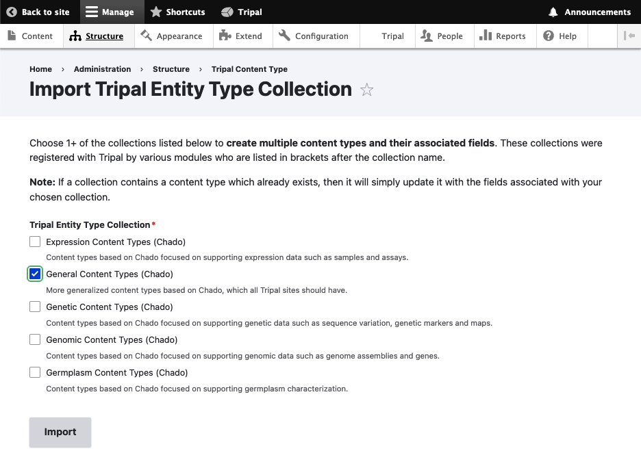
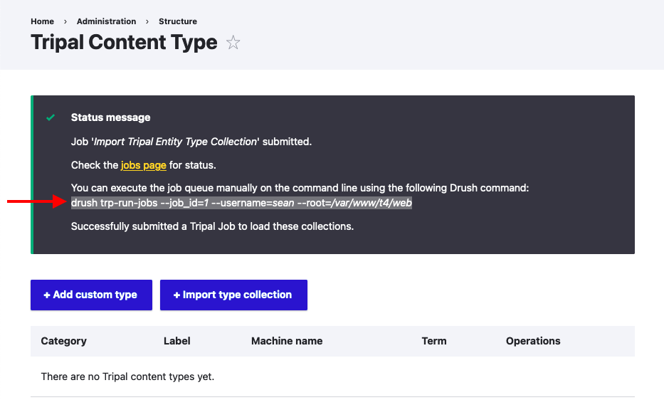

Import General Content Types
============================

When you first install Tripal, you do not yet have any content types created. This is to provide you with flexibility to only add the content types you need for your data.

For most Tripal sites, you will want to at least enable the "General Content Types". To do this, navigate to **Manage → Structure → Tripal Content Types** and click "+Import Type Collection", or simply visit ``admin/structure/bio_data/import-collection`` on your site.

On this page, you will be presented with the categories of content types that have been included with Tripal, as seen on the `Anatomy of a Tripal Site <anatomy_of_content.html>`_ page.

Check the boxes for "General Content Types (Chado)", then click "Import".

You will be given a Drush command that you should run via the command line from within the web directory of your server: 

Now run the submitted Tripal job from command line as follows if Drupal/Tripal is running as a web application:

::

  drush trp-run-jobs --username=drupaladmin --root=/var/www/drupal/web

If Tripal is running from a docker container named $cntr_name, run:

::

  docker exec -it $cntr_name drush trp-run-jobs --username=drupaladmin --root=/var/www/drupal/web

You will see the following output:

::

  2024-02-14 21:34:50
  Tripal Job Launcher
  Running as user 'drupaladmin'
  -------------------
  2024-02-14 21:34:50: Job ID 1.
  2024-02-14 21:34:50: Calling: import_tripalentitytype_collection(Array)
  [notice] Creating Tripal Content Types from: Genomic Content Types (Chado)
  [notice] Content type, "Gene", created.
  [notice] Content type, "mRNA", created.
  [notice] Content type, "Phylogenetic Tree", created.
  [notice] Content type, "Physical Map", created.
  [notice] Content type, "DNA Library", created.
  [notice] Content type, "Genome Assembly", created.
  [notice] Content type, "Genome Annotation", created.
  [notice] Content type, "Genome Project", created.
  [notice] Attaching fields to Tripal content types from: Chado Fields for Genomic Content Types
  :::
  :::
  :::
