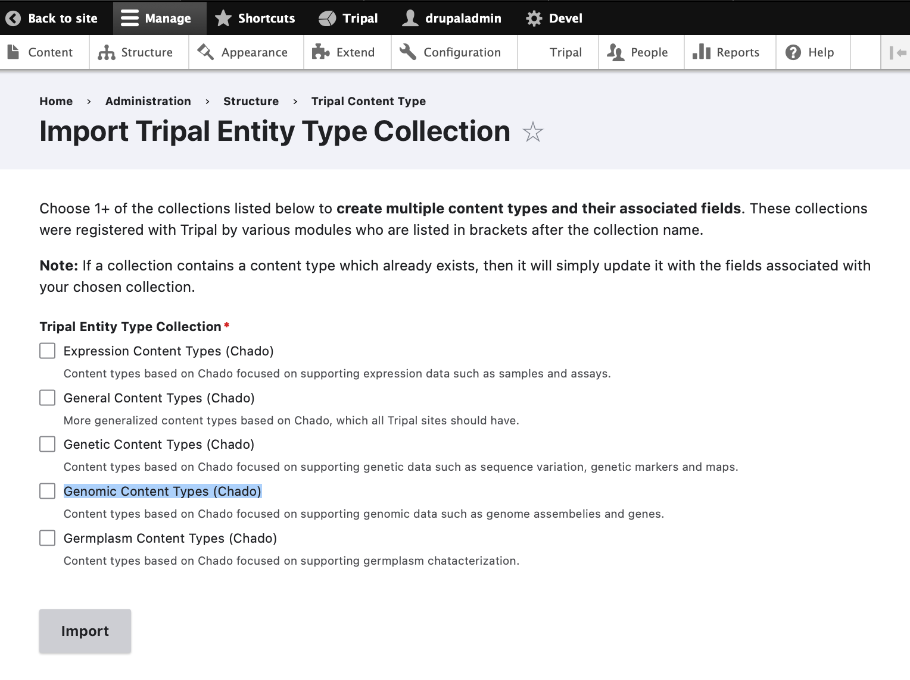

Example Genomic Site Setup 
============================

The following tutorial will walk you through creating content and loading genomic data. This is a good introduction to Tripal v4.x Content Types and the new Administrative User Interface regardless of whether you intend to store genomic data in your particular Tripal v4 site. This demonstration uses three extension modules: Tripal Analysis Blast, Tripal Analysis KEGG, and Tripal Analysis InterPro.

Freshly installed Tripal 4 has only Generic content types activated. It is necessary to add *Genomic* content types to setup a site containing Gene and related content. This is done by **Structure** -> **Tripal Content Types** -> + **Import type Collection** -> Check **Genomic Content Types (Chado)** and clicking on **Import**  

Now run the submitted Tripal job from command line as follows if Drupal/Tripal is running as a web application:

::

  drush trp-run-jobs --username=drupaladmin --root=/var/www/drupal/web

If Tripal is running from a docker container named $cntr_name, run:

::

  docker exec -it $cntr_name drush trp-run-jobs --username=drupaladmin --root=/var/www/drupal/web

You will see the following output:

::

  2024-02-14 21:34:50
  Tripal Job Launcher
  Running as user 'drupaladmin'
  -------------------
  2024-02-14 21:34:50: Job ID 1.
  2024-02-14 21:34:50: Calling: import_tripalentitytype_collection(Array)
  [notice] Creating Tripal Content Types from: Genomic Content Types (Chado)
  [notice] Content type, "Gene", created.
  [notice] Content type, "mRNA", created.
  [notice] Content type, "Phylogenetic Tree", created.
  [notice] Content type, "Physical Map", created.
  [notice] Content type, "DNA Library", created.
  [notice] Content type, "Genome Assembly", created.
  [notice] Content type, "Genome Annotation", created.
  [notice] Content type, "Genome Project", created.
  [notice] Attaching fields to Tripal content types from: Chado Fields for Genomic Content Types
  :::
  :::
  :::

Now,  **Structure -> Tripal Content Types** show Tripal Contents with Genomic Category, that include Gene and other content required for the Example Genomic site.

.. note::

  As a rule, extension modules are not documented in the Tripal User’s Guide. You can find documentation for extension modules ( **Tripal** -> **Extensions** ) that enhance Tripal functionality on the Extension Modules page. However, to provide a functioning demonstration the three analysis extension modules are described here.

.. toctree::
   :maxdepth: 1
   :caption: Table of Contents
   :glob:

   ./example_genomic/organisms
   ./example_genomic/analyses
   ./example_genomic/cross_references
   ./example_genomic/controlled_vocabs
   ./example_genomic/genomes_and_genes
   ./example_genomic/importing_publications 
   ./example_genomic/functional_annotations
