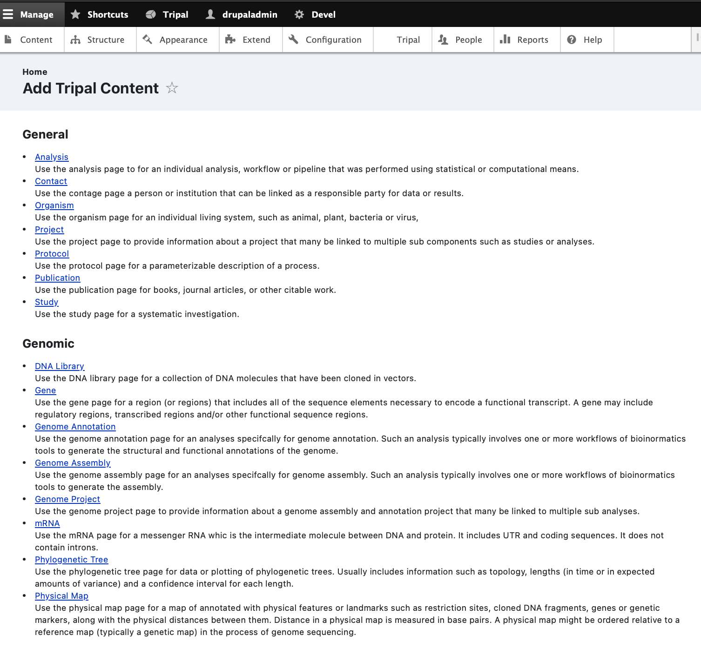
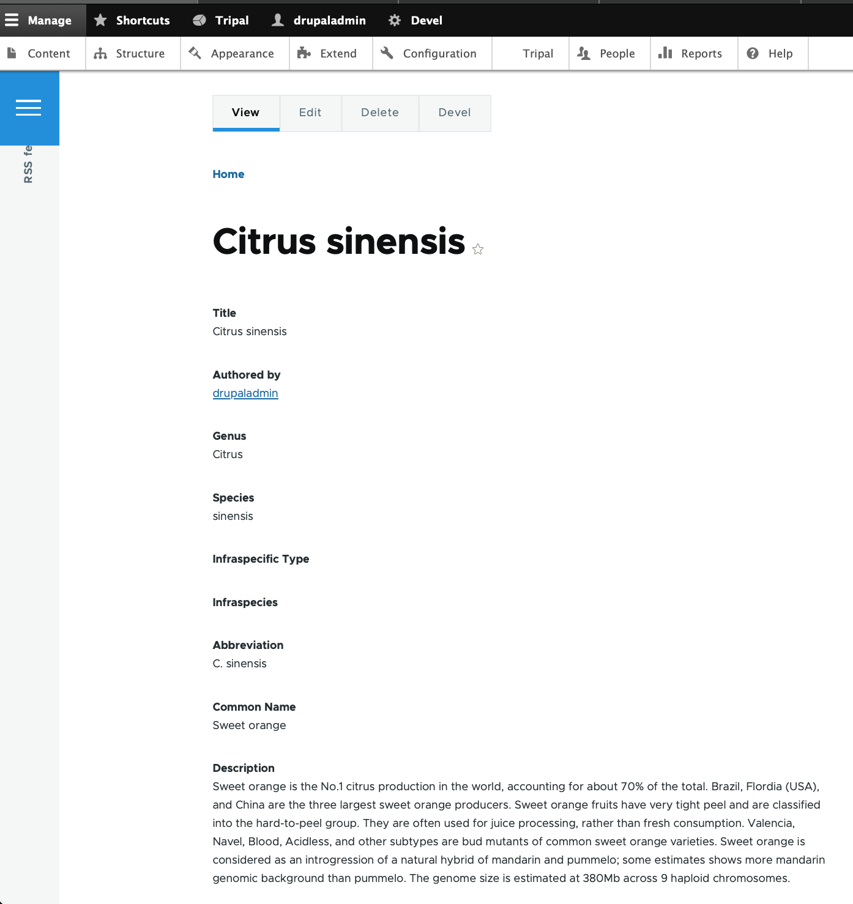
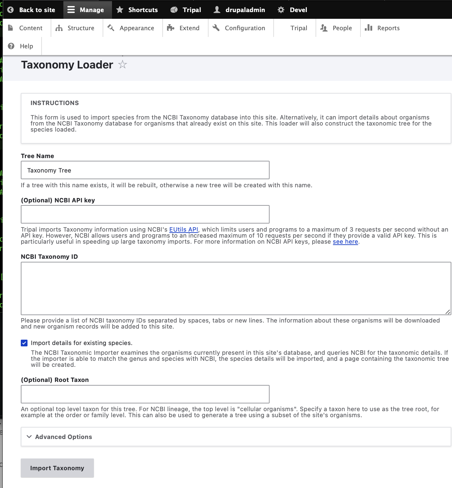
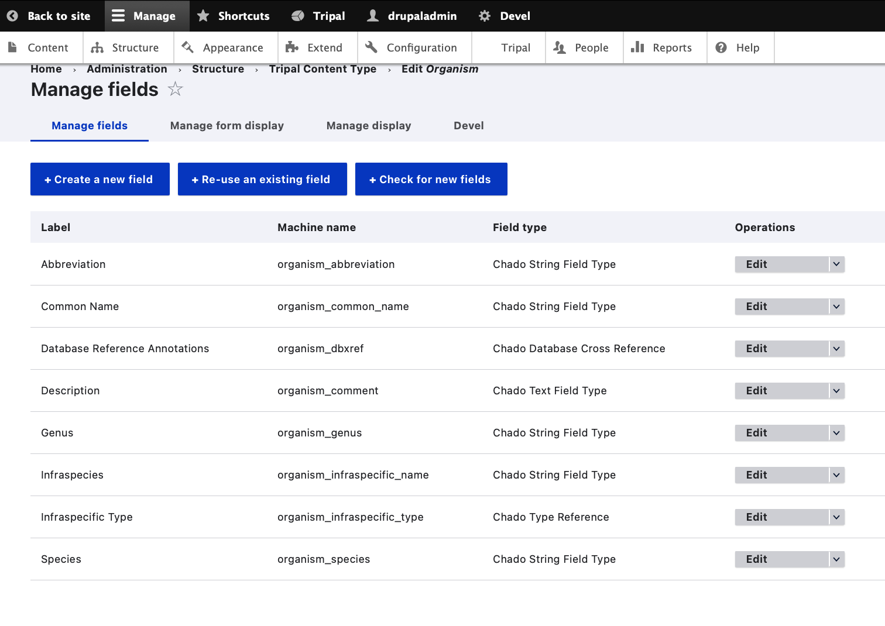
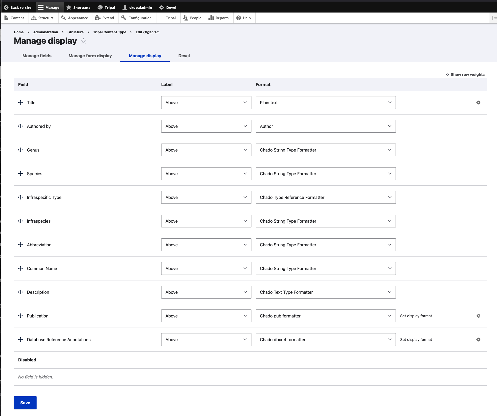

Create an Organism Page
=========================

Before we can load our data we must first have an organism to which the data will be associated. Chado v1.3 does not come preloaded with any organisms (although previous version of Chado do). For this tutorial we will import genomic data for Citrus sinesis (sweet orange), so we must first create the organism.

We can add the organism using the **Add Tripal Content** link in the top administrative menu or from **Content** -> **Add Tripal Content**. The Add Tripal Content page has several content types already available, including the **Organism** content type.

.. note::

 Drupal provides its own content types such as **Article** and **Basic Page**. These content types are referred to as **nodes** in Drupal speak. You can add these content types via the **Add Content** page. Tripal v4 derived content types are separated from these Drupal content types.

To add a new organism click the **Organism** link and a form will appear with multiple fields. Fill in the fields with these values:

.. csv-table::
  :widths: 10,50
  :header: "Field Name", "Value"

  "Genus", "Citrus"
  "Species", "sinensis"
  "Abbreviation", "C\. sinensis"
  "Common name", "Sweet orange"
  "Description",	"Sweet orange is the No.1 citrus production in the world, accounting for about 70% of the total. Brazil, Flordia (USA), and China are the three largest sweet orange producers. Sweet orange fruits have very tight peel and are classified into the hard-to-peel group. They are often used for juice processing, rather than fresh consumption. Valencia, Navel, Blood, Acidless, and other subtypes are bud mutants of common sweet orange varieties. Sweet orange is considered as an introgression of a natural hybrid of mandarin and pummelo; some estimates shows more mandarin genomic background than pummelo. The genome size is estimated at 380Mb across 9 haploid chromosomes."

Leave all remaining fields empty and save the page. You should now have an organism page that appears as follows:

.. note::

  The layout of the organism page is provided by the **tripal_ds** module that was enabled during Tripal installation.  If you decided not to enable that module then your page will look quite different.

Load data from NCBI Taxonomy
----------------------------
Tripal makes it easy to import additional information about any organisms within a Tripal site from the `NCBI Taxonomy database <https://www.ncbi.nlm.nih.gov/taxonomy>`_.  The importer will only import data for species that you currently have in the Tripal database.  The taxonomic names must match those in the NCBI Taxonomy database.  Currently, we only have a single organism (Citrus sinensis) and we will import additional properties for this organism from NCBI but we can return later to import data for new organisms we may add later.  To import additional organism details, navigate to **Tripal → Data Loaders → Taxonomy Loader**.  The following page appears:

Click the checkbox beside the 'Import taxonomy for existing species' and click Import Taxonomy.  Now run the submitted job:

::

  drush trp-run-jobs --username=administrator --root=/var/www/drupal/web

If Tripal is running from a docker container named $cntr_name,

::

  docker exec -it $cntr_name drush trp-run-jobs --username=drupaladmin --root=/var/www/drupal/web

You will see the following output:

::

  024-02-14 18:58:58
  Tripal Job Launcher
  Running as user 'drupaladmin'
  -------------------
  2024-02-14 18:58:58: Job ID 2.
  2024-02-14 18:58:58: Calling: tripal_run_importer(5)
  Running 'Taxonomy Loader' importer
  NOTE: Loading of this file is performed using a database transaction. If it fails or is terminated prematurely then all insertions and updates are rolled back and will not be found in the database
  Initializing Tree...
  Insert phylotree: Created phylotree with phylotree_id: <em class="placeholder">1</em>
  Import phylotree summary: <em class="placeholder">0</em> nodes were successfully associated to content, <em class="placeholder">0</em> nodes could not be associated
  Rebuilding Tree...
  Percent complete: 0%. Memory: 34,690,376 bytes.
  Updating Existing...
  Percent complete: 100.00 %. Memory: 34,722,768 bytes.
  Percent complete: 100.00 %. Memory: 34,723,296 bytes.
  Import phylotree: Associated <em class="placeholder">Citrus sinensis</em> to organism_id: <em class="placeholder">1</em>
  Import phylotree summary: <em class="placeholder">1</em> nodes were successfully associated to content, <em class="placeholder">0</em> nodes could not be associated
  Done.

Now, Click on **Tripal Content -> + Publish Tripal Content -> Content Type -> Organism**
Run the jobs as mentioned earlier followed by :

::

 docker exec -it $cntr_name drush cr

to clear the drush cache. Now, clicking on **Tripal Content -> Organism=Citrus ** will show Taxonomy Reference Annotation of NCBI 2711 associated with Citrus sinensis. Editing of this organism also shows it.

Adding New Fields
-----------------

.. note::
  This feature has not yet been implemented for Tripal v4, documentation will be added once this feature is available

We have now imported many new properties about the Citrus sinensis organism from NCBI Taxonomy.  However, these properties won't show up on the page automatically.  We need to tell Drupal that our organism pages now have new property fields for display.
To do this, navigate to **Structure → Tripal Content Type** and in the row for the Organism content type, click Drop Down arrow and mouse over on **Manage Fields**. Here we see a list of fields that are associated with an Organism content type.

Click the link at the top of the page **+ Check for new fields**.

.. note::

  The **Check for new fields** functionality has not yet been implemented for Tripal 4. Documentation  will be added when it is available.

Drupal now knows about these new fields! But if we were to look at the Citrus sinensis page we would see that the new properties do not appear. Despite that Drupal knows about the fields it has disabled their display. To enable display of these fields click the **Manage Display** tab at the top right of the page. Here all of the fields are organized into the structure that they will be displayed on the page. Later in this tutorial a more formal description is provided about how you use this interface to change the way the page appears. For now, we simply need to get the new fields to be shown. Scroll to the bottom of the page and the new fields can be seen in the Disabled section.

We can move these newly created fields out of the Disabled section by clicking on the cross-hair icons to the left of the name and dragging the field into a section above.   Drag these fields into the **Summary** section underneath the **Summary Table**.  Notice in the screenshot below that the fields that were once in the **Disabled** section are now in the **Summary Table** section.  Click the **Save** button at the bottom to make all changes final.

Now, if we return to the organism page we will see these new properties were added to the page inside of the Summary Table.

Further Customizations
----------------------

You may not like this arrangement of fields.  You may prefer to place these extra fields inside of a new **pane** rather than inside of the **Summary pane**.  Perhaps a pane named Additional Details.  You can rearrange the order of these fields and create new panes, as desired by following the more details instructions on the `Configure Page Display page <../configuring_page_display>`_ of this tutorial.  For example, the following shows these fields organized into a new pane named **Additional Details** which is separate from the **Summary** Pane.  Note the table of contents sidebar now lists the **Summary** and **Additional Details** links.  When clicked, the pane selected by the user migrates to the top of the page

Additional Resources:

 `Tripal 3 reference for creating organism <https://tripal.readthedocs.io/en/latest/user_guide/example_genomics/organisms.html>`_

.. note::

  **Database Reference Annotations** that appear in the **Organism** creation page have not yet been implemented for Tripal v4, documentation will be added once this feature is available.
