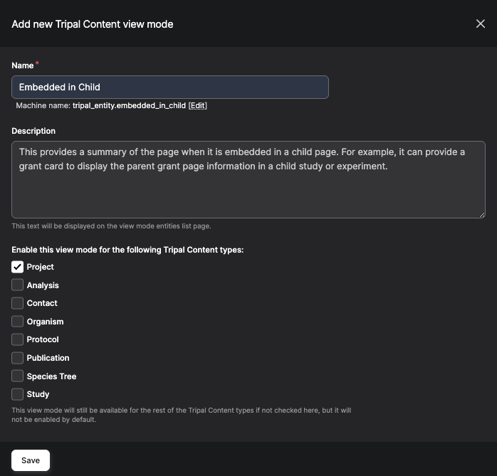
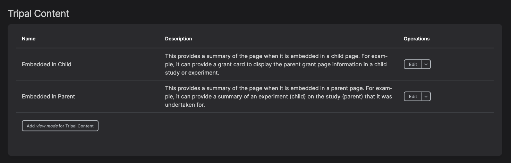
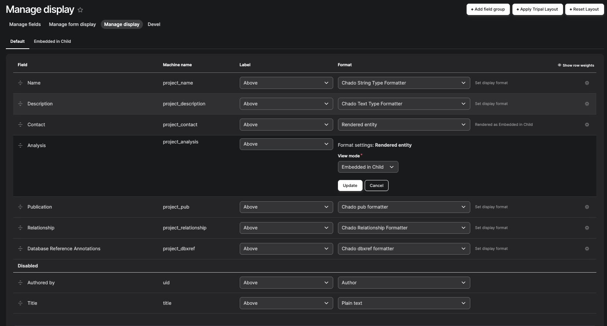

Configuring the view mode
==========================

By default, when Tripal is installed, each field uses its default formatter configuration. However, you may want to display content differently in various contexts, such as embedding entities using the embedded entity formatter. To achieve this, you can create and use additional view modes in Drupal.

Creating a new view mode
-------------------------

    1. Navigate to **Admin → Structure → Display Modes → View Modes**.
    2. Click **Add View Mode**.
    3. Select Tripal Content.
    4. Enter a descriptive name for your new view mode (e.g., “Embedded in Child”), add a short description, and specify which content types this view mode should be available for.
    5. **Save** the new view mode.

Using the created view modes
-----------------------------

    1. Navigate to **Tripal → Page Structure**.
    2. Click on **Manage Display** on the selected content type.
    3. For the field you want to customize, select **Rendered entity** from the dropdown.
    4. Click the gear icon next to the field.
    5. In format settings, choose the view mode you created in the previous step.
    6. **Update** and **Save** your changes.

