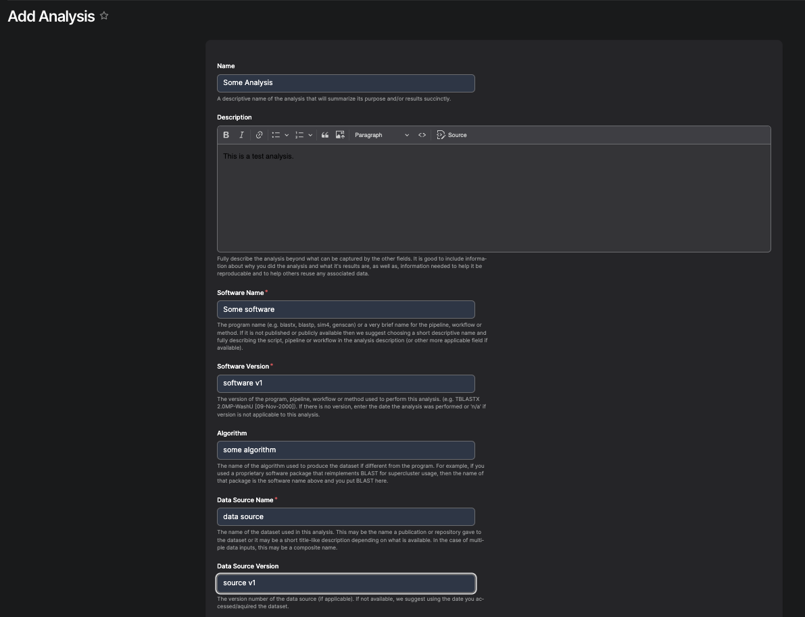
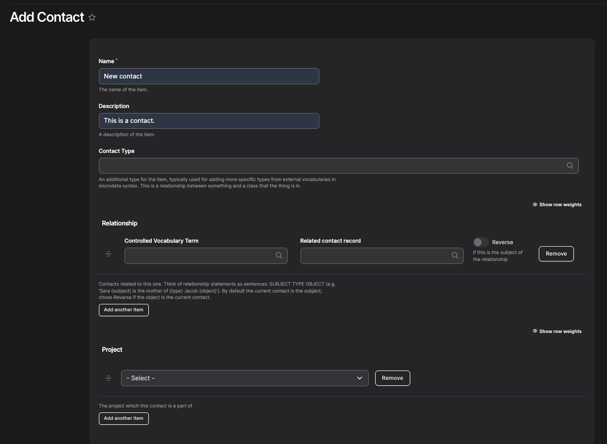
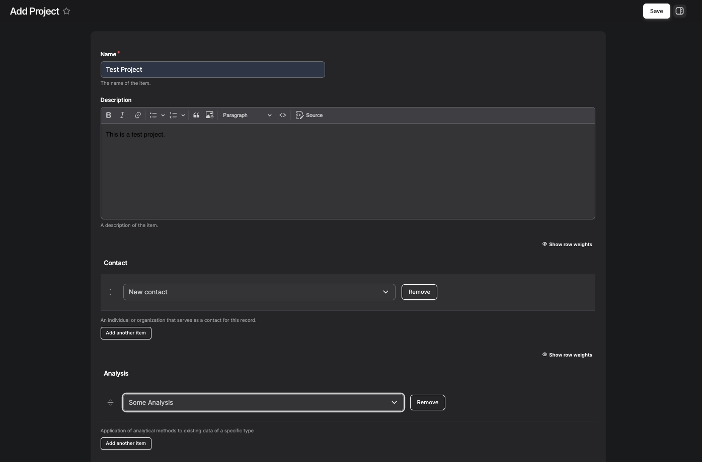
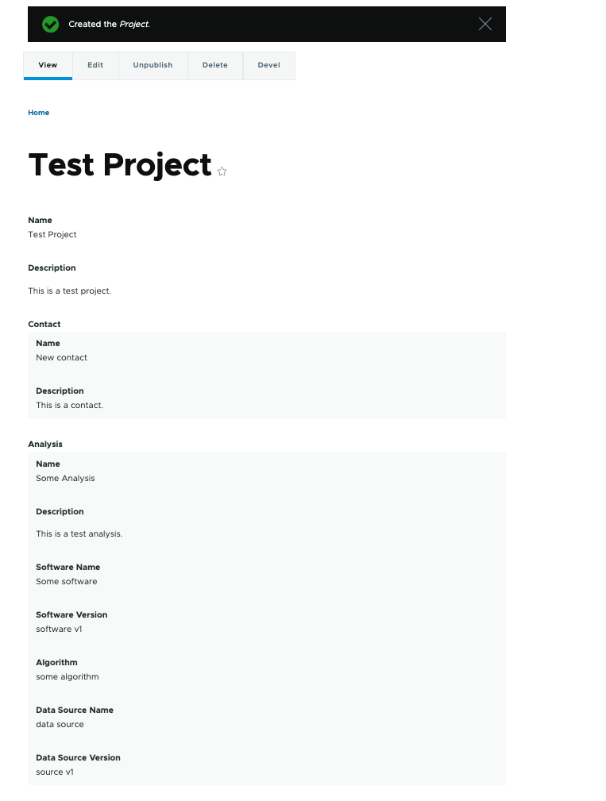
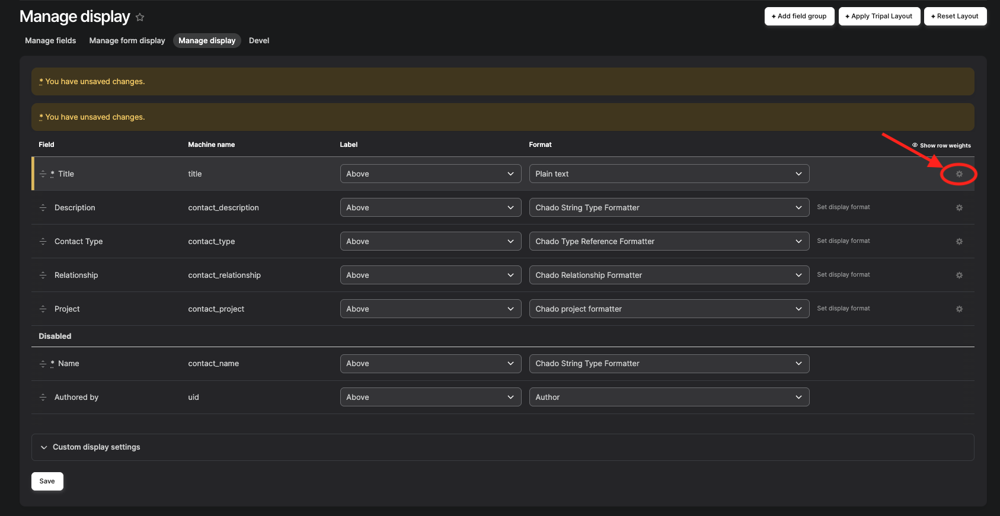
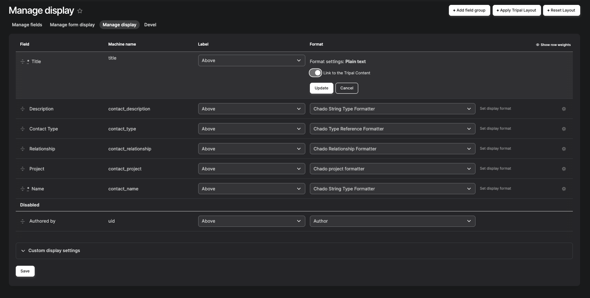
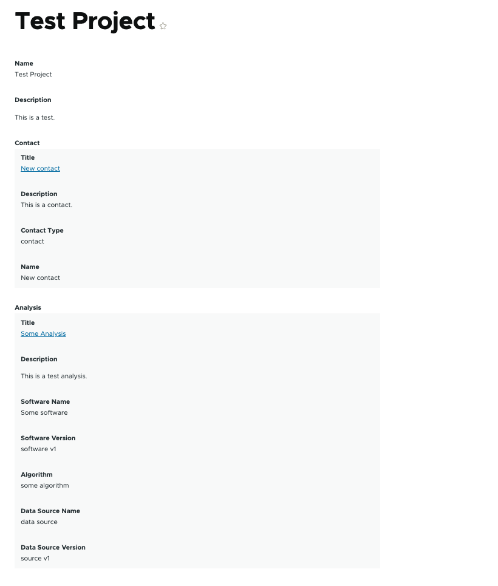

Embedded Entity Formatter for Linker Fields
============================================

This formatter would be available to all Linker Fields in Tripal Chado. It would allow the admin to configure the view mode they want to use and it would embed a rendered version of the linked entity using that entity_id and view mode.

Using the formatter
----------------------

- Start by creating the content items that you want to embed within another entity.

    1. Navigate to **Tripal → Content → Add Tripal Content → [CONTENT TYPE]**.
    2. The following examples of child content types include Analysis or Contact.

- Next, create the parent content type that will display the embedded entities.

    1. Go to **Tripal → Content → Add Tripal Content → [CONTENT TYPE]**.
    2. Link the previously created child content to this entity (parent).
        - Example: Create a Project content type and link the previously created Analysis and Contact entities to it.

- Once the parent content is created, the linked entities should appear embedded within the parent entity's display, rendered according to the selected view mode.

**Example:**

Adding clickable links to the linked contents
---------------------------------------------
1. Navigate to **Tripal → Page Structure**.
2. Go to the **"Manage Display"** page for each entity that needs to be embedded. (In the example above, this means managing display settings for both Contact and Analysis.)
3. Move "Name" to Disabled section and move the "Title" from Disabled to the top section.
4. Click on the gear icon for the title section.

5. Enable the toggle for "Link to Tripal Content".

6. Click "Update" and then "Save".
7. Oncec you create the new parent entity (e.g., Project), the titles of the linked entities (such as Contact and Analysis) will appear as clickable links, as shown below.

