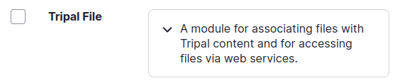
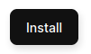
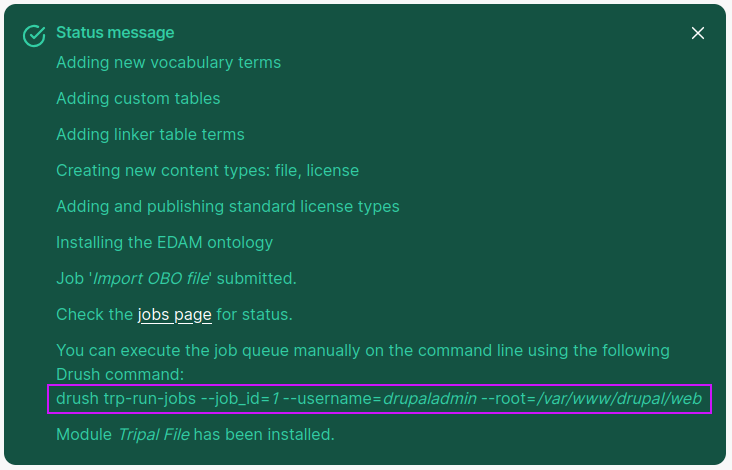
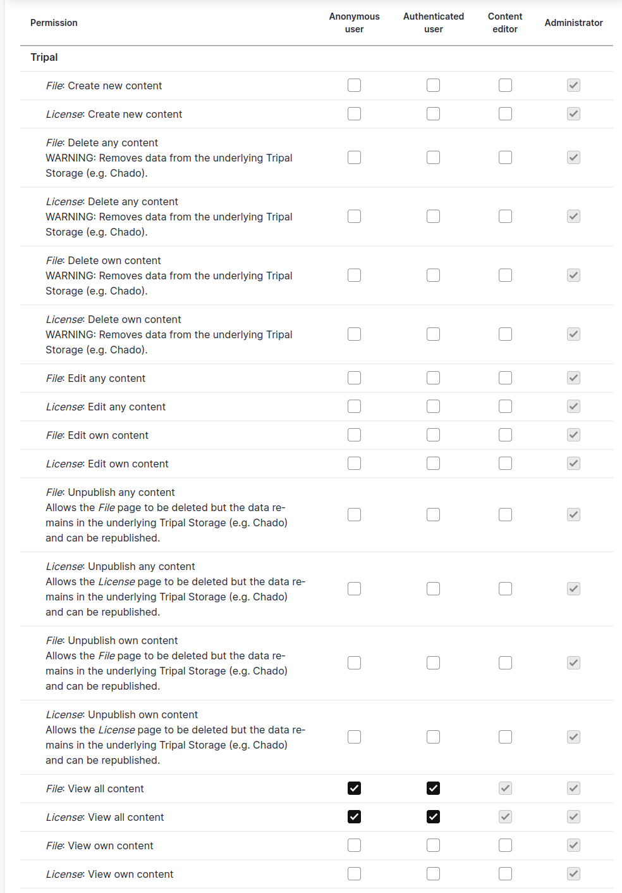

Installation
============

Module Installation
--------------------

The Tripal File module is one of the core Tripal modules, so will be
available on any Tripal site, it simply needs to be enabled.

.. warning::

  If you are migrating a Tripal 3 site to Tripal 4, you must perform the :ref:`Migrating Chado`
  process before enabling this module, to make sure all new terms used by this module
  are present in your chado instance.

When this module is enabled, it will create two new content types: `File` and `License`.
It will also create a variety of tables in your Chado database for
associating files to other content types.

You may activate the module either using drush on the command line, or activate via the GUI.

.. note::

  The `EDAM vocabulary <http://edamontology.org/page>`_ is imported when the the Tripal File module
  is enabled, because it provides terms for many common biological file types (e.g. FASTA, GFF3, VCF, etc.).
  Any file that is managed by the Tripal File module requires a file type.

Install using a Drush command
^^^^^^^^^^^^^^^^^^^^^^^^^^^^^

The following command can be used to enable the Tripal File module:

.. code-block:: bash

  drush pm-enable tripal_file

You should see output similar to this when the command is run:

.. code-block:: text

  [notice] Adding new vocabulary terms
  [notice] Adding custom tables
  [notice] Adding linker table terms
  [notice] Creating new content types: file, license
  [notice] Creating Tripal Content Types from: Tripal File Content Types (Tripal File)
  [notice] Content type, "File", created.
  [notice] Content type, "License", created.
  [notice] Attaching fields to Tripal content types from: Tripal File Fields
  [notice] Added field, "file_name", to content type: "tripal_file".
  [notice] Added field, "file_description", to content type: "tripal_file".
  [notice] Added field, "file_type", to content type: "tripal_file".
  [notice] Added field, "file_license", to content type: "tripal_file".
  [notice] Added field, "file_location", to content type: "tripal_file".
  [notice] Added field, "file_relationship", to content type: "tripal_file".
  [notice] Added field, "file_dbxref", to content type: "tripal_file".
  [notice] Added field, "analysis_file", to content type: "tripal_file".
  [notice] Added field, "file_contact", to content type: "tripal_file".
  [notice] Added field, "organism_file", to content type: "tripal_file".
  [notice] Added field, "project_file", to content type: "tripal_file".
  [notice] Added field, "file_pub", to content type: "tripal_file".
  [notice] Added field, "study_file", to content type: "tripal_file".
  [notice] Added field, "license_name", to content type: "tripal_license".
  [notice] Added field, "license_summary", to content type: "tripal_license".
  [notice] Added field, "license_uri", to content type: "tripal_license".
  [notice] Adding and publishing standard license types
  [notice] Initializing publish
  [notice] Finding all candidate records in the "license" chado table
  [notice] Preparing to publish 3 "tripal_license" records
  [notice] Step 1 of 6: Find matching records
  [notice] Step 2 of 6: Generate page titles
  [notice] Step 3 of 6: Find existing published entity titles
  [notice] Step 4 of 6: Updating existing page titles
  [notice] Step 5 of 6: Publishing 3 new entities
  [notice] Step 6 of 6: Adding field items to published entities
  [notice]   Published 3 items for field "license_name"
  [notice]   Published 3 items for field "license_summary"
  [notice]   Published 2 items for field "license_uri"
  [notice] Publish completed. Published 3 new entities, checked 0 existing entities,
  added 8 new field values, and republished 0 existing field values.
  [notice] Installing the EDAM ontology
  [notice] Downloading URL "https://edamontology.org/EDAM.obo", saving to "/tmp/obo_v0lM58"
  [notice] Importing into schema "chado"
  [notice] Step 1: Preloading File "/tmp/obo_v0lM58"...
  [notice] Percent complete: 0%. Memory: 98,955,896 bytes.
  [notice] Percent complete: 5.00 %. Memory: 99,479,976 bytes.
  [notice] Percent complete: 10.01 %. Memory: 100,071,976 bytes.
  ...
  [notice] Percent complete: 95.01 %. Memory: 108,600,216 bytes.
  [notice] Percent complete: 100.00 %. Memory: 109,079,472 bytes.
  [notice] Percent complete: 100.00 %. Memory: 109,079,832 bytes.
  [notice] Percent complete: 100.00 %. Memory: 109,081,320 bytes.
  [notice] Found the following namespaces: EDAM.
  [notice] Step 2: Examining relationships...
  [notice] Percent complete: 0%. Memory: 109,071,064 bytes.
  [notice] Step 3: Loading type defs...
  [notice] Percent complete: 0%. Memory: 109,072,680 bytes.
  [notice] Percent complete: 15.38 %. Memory: 109,075,352 bytes.
  [notice] Percent complete: 30.77 %. Memory: 109,075,416 bytes.
  [notice] Percent complete: 100.00 %. Memory: 109,076,024 bytes.
  [notice] Percent complete: 100.00 %. Memory: 109,076,384 bytes.
  [notice] Percent complete: 100.00 %. Memory: 109,076,056 bytes.
  [notice] Step 4: Loading terms...
  [notice] Percent complete: 0%. Memory: 109,076,056 bytes.
  [notice] Percent complete: 0%. Memory: 109,076,056 bytes.
  [notice] Percent complete: 1.02 %. Memory: 109,082,624 bytes.
  [notice] Percent complete: 2.00 %. Memory: 109,090,392 bytes.
  [notice] Percent complete: 3.02 %. Memory: 109,096,856 bytes.
  ...
  [notice] Percent complete: 97.01 %. Memory: 109,340,336 bytes.
  [notice] Cannot add Alt ID "topic_3040" without an accession
  [notice] Percent complete: 98.03 %. Memory: 109,340,944 bytes.
  [notice] Percent complete: 99.02 %. Memory: 109,341,360 bytes.
  [notice] Percent complete: 100.00 %. Memory: 109,341,808 bytes.
  [notice] Percent complete: 100.00 %. Memory: 109,342,168 bytes.
  [notice] Step 5: Cleanup...
  [notice] Updating the cv_root_mview materialized view...
  [notice] Updating the db2cv_mview materialized view...
  [success] Module tripal_file has been installed.

Install using the GUI
^^^^^^^^^^^^^^^^^^^^^

You will need to be logged into your site as a user that has administrative permissions.

1. From the administrative menu select "Extend"

2. Scroll down to the "Tripal File" module, or enter "Tripal File" in the filter box, and check the box for the **Tripal File** module.

3. Click the "Install" button

4. After several seconds you should see a screen similar to this

5. The drush command you will need to run is shown, it is highlighted in this example.
   Copy your version of this command, it will be different than the one shown in the
   example here, and run it at the command line.

Set Permissions
----------------

As with other tripal content types, permissions can be granted specifically to each content type.
See :ref:`User Permissions` for more details about how permissions work.

The Tripal File module creates the following default permissions, you can alter these as appropriate to your needs.

.. warning::

  Never grant the anonymous user any permissions other than "View all content".
