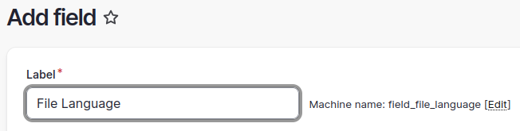
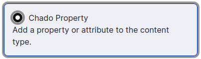
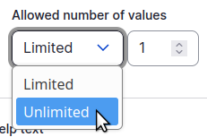

Tripal File Usage
===================

Adding a License
------------------
To ensure data files offered by your Tripal site meet
`FAIR data principles <https://www.go-fair.org/fair-principles/>`_,
all files must be associated with a license.
Therefore, before adding any files, you must first define the **License** types that you will need.
A few standard licenses are created when the module is installed, and
you can create as many other **License** types as needed for the data on your site.

To create a new license type, on the shortcuts tool bar click on the Tripal icon.

.. image:: usage.1.tripal-menu.png

From the drop-down menu select **Content**.
Then click on **+Add Tripal Content**

.. image:: usage.2.add-tripal-content.png

There you can scroll to the **License** type and click on it.

.. image:: usage.3.add-license.png

To create your license page you can:

 * Option 1: Fully define the license by giving it a name and provide the full description
 * Option 2: Summarize the license by giving a name, providing a brief summary (or no summary)
   and providing the URL to the full license online.

For example:

.. image:: usage.4.add-license.png

.. note::

  It is best practice to provide a human readable summary of the user's rights in the
  Summary field and to provide a link to the full legal text of the license via the URI field.

Adding a File
---------------

A file can be either located locally on your site, or be a URL that references a location anywhere on the internet.

.. warning::

   Local file upload has not yet been implemented.

.. note::

  If you have followed the Tripal User's Guide you will have an analysis appropriate to link
  to the file in the following example, or you can follow
  :ref:`these instructions to create an Analysis page <Create a Genome Assembly Page>`.
  However, linking an analysis is optional.

To create a new file page, on the administrative tool bar click on the Tripal icon.

.. image:: usage.1.tripal-menu.png

From the drop-down menu select **Content**.
Then click on **+Add Tripal Content**

.. image:: usage.2.add-tripal-content.png

There you can scroll to the **File** type and click on it.

.. image:: usage.5.add-file.png

On this page you can:

1. Provide a **name** (required) and **description** for the file.
2. Indicate a file **type** (required).
3. Indicate the file **source** (or contact person) who has rights to the data.
4. Indicate the file **location** (either locally or via remote URL).
5. And set the **license** (required).
6. Optionally specify relationships or other linked records, such as analysis or publication.

First, we will create a **file** page to reference a FASTA file for scaffold 1 of the whole genome assembly.
Enter the following in the File page fields:

+---------------------+--------------+--------------------------------------------------------------------------+
| Field               | Value                                                                                   |
+=====================+==============+==========================================================================+
| Name                | *Citrus sinesis* Whole Genome Assembly v1.0 scaffold 1                                  |
+---------------------+--------------+--------------------------------------------------------------------------+
| File Type           | FASTA (format:1929)                                                                     |
+---------------------+--------------+--------------------------------------------------------------------------+
| Description         | The whole genome assembly, v1.0, of *Citrus sinensis* GCA_000695605.1, scaffold 1.      |
+---------------------+--------------+--------------------------------------------------------------------------+
| File Source         | *Leave blank or provide any contact you may have already*                               |
+---------------------+--------------+--------------------------------------------------------------------------+
| File Location       | URI          | https://www.ncbi.nlm.nih.gov/nuccore/KK784873.1?report=fasta&format=text |
+                     +--------------+--------------------------------------------------------------------------+
|                     | File Name    | Citrus sinensis-scaffold00001.fasta                                      |
+                     +--------------+--------------------------------------------------------------------------+
|                     | File Size    | *Leave blank*                                                            |
+                     +--------------+--------------------------------------------------------------------------+
|                     | MD5 Checksum | *Leave blank*                                                            |
+---------------------+--------------+--------------------------------------------------------------------------+
| License             | CC0 1.0 Universal (CC0 1.0) Public Domain Dedication                                    |
+---------------------+--------------+--------------------------------------------------------------------------+
| Analysis (optional) | Whole Genome Assembly and Annotation of Citrus sinensis (JGI)                           |
+---------------------+--------------+--------------------------------------------------------------------------+

.. note::

  You can use a `public://` prefix for local files, in which case the file size and MD5 checksum can be
  automatically included. As an example, you might upload a file to your local filesystem in the directory

  `sites/default/files/bulk_data/`

  and then you could specify a URI of

  `public://bulk_data/Citrus_sinensis-scaffold00001.fasta`

.. note::

  A file can have more than one download location, and you can combine both local and remote files.

.. note::

  Providing a file source or "contact" is optional, but is recommended.
  Every file with a license should indicate, via the "file source" field,
  who retains the license rights (if applicable).

After creation, the file page will look like this. Here a publication and contact have been included.

.. image:: usage.7.file-created.png

Adding File Metadata
----------------------

Manually Adding Metadata
``````````````````````````

You can add additional metadata to a file by adding new fields to the file content type.

On the shortcuts tool bar click on the Tripal icon.

.. image:: usage.1.tripal-menu.png

From the drop-down menu select **Page Structure**.
Then on the **Tripal File** content type select **Manage fields**

.. image:: usage.8.manage-fields.png

The next page lists existing fields. We want to create a new property field, so click on **+ Create a new field**.

.. image:: usage.9.create-a-new-field.png

You will want to select the **Chado Fields** type

.. image:: usage.10.chado-fields.png

Then you will want to specify a name appropriate for the property you want to add.
For example, we might want to add a field to indicate the language for a document file.



Then find the **Chado property** type and select it.



One document could contain parts written in different languages, so we probably want to change the **Allowed number of values** to unlimited.



Finally, we specify an appropriate controlled vocabulary term for the field. All fields require a term.

.. image:: usage.14.term.png

If we return to any **File** page and edit it, we will now have a new metadata field
for storing the language or languages.

.. image:: usage.15.widget-language.png

Adding Metadata in Bulk
`````````````````````````

.. warning::

  A method for adding metadata in bulk has not yet been implemented.


Associating a File with Other Content
---------------------------------------

Now that we have a file page, we can associate that file with any other Tripal-based content.
For this example, we will create a genome assembly project and associate the file with that project.

Before we can associate a file with a project, we must first add a new field for the file
to the Project content type.

On the shortcuts tool bar click on the Tripal icon.

.. image:: usage.1.tripal-menu.png

From the drop-down menu select **Page Structure**.
Then on the Project content type select **Manage fields**

The next page lists existing fields. Now click on **+ Check for new fields**.
The File field should be detected and checked by default.

.. image:: usage.16.add-file-field.png

Click the **Add fields** button.

Now create a new **Project** page.
On this page will be a field to add one or more files, for example

.. image:: usage.17.file-widget.png

Once the project is saved, clicking the file link will take the user to the
full file page where they can download the file, view the license information,
and view metadata about the file.

.. note::

  Once the number of files on your site exceeds a configurable limit, which defaults to 50,
  the file select will change to an autocomplete field.

Accessing Files via Web-Services
----------------------------------

.. warning::

  Web services have not yet been implemented in Tripal 4.

Tripal File Module Chado Tables
---------------------------------

The license Table
```````````````````

The *license* table houses the base license record.
The *name* field must be a unique value for each file and thus can be selected on for finding licenses.
The *uri* field can be null, but if not null, it must be unique for each license.

+-------------+-------------------------+------+---------------+---------------------------+
| Column      | Type	                | Null | Default Value | Constraint                |
+=============+=========================+======+===============+===========================+
| license_id  | bigint                  | No   | (auto)        | Primary Key               |
+-------------+-------------------------+------+---------------+---------------------------+
| name        | character varying(1024) | No   |               | Unique                    |
+-------------+-------------------------+------+---------------+---------------------------+
| summary     | text                    | Yes  |               |                           |
+-------------+-------------------------+------+---------------+---------------------------+
| uri         | text                    | Yes  |               | Unique or null            |
+-------------+-------------------------+------+---------------+---------------------------+

The file Table
````````````````

The *file* table houses the base file record.
The *name* field must be a unique value for each file and thus can be selected on for finding files.

+-------------+------------+------+---------------+---------------------------+
| Column      | Type	   | Null | Default Value | Constraint                |
+=============+============+======+===============+===========================+
| file_id     | bigint     | No   | (auto)        | Primary Key               |
+-------------+------------+------+---------------+---------------------------+
| name        | text       | No   |               | Unique                    |
+-------------+------------+------+---------------+---------------------------+
| type_id     | integer    | No   |               | Foreign Key to **cvterm** |
+-------------+------------+------+---------------+---------------------------+
| description | text       | Yes  |               |                           |
+-------------+------------+------+---------------+---------------------------+

The fileprop Table
````````````````````

The *fileprop* table holds the properties or metadata about files.
The CV term is specified using the *type_id* column
and the rank is incremented if multiple values of the same type are stored.

+-------------+------------+------+---------------+---------------------------+
| Column      | Type	   | Null | Default Value | Constraint                |
+=============+============+======+===============+===========================+
| fileprop_id | bigint     | No   | (auto)        | Primary Key               |
+-------------+------------+------+---------------+---------------------------+
| file_id     | integer    | No   |               | Foreign Key to **file**   |
+-------------+------------+------+---------------+---------------------------+
| type_id     | integer    | No   |               | Foreign Key to **cvterm** |
+-------------+------------+------+---------------+---------------------------+
| value       | text       | Yes  |               |                           |
+-------------+------------+------+---------------+---------------------------+
| rank        | integer    | No   | 0             |                           |
+-------------+------------+------+---------------+---------------------------+

The fileloc Table
```````````````````

The *fileloc* table indicates where files can be downloaded.
The *uri* column must contain the URI of the file.
Even local files have a URI.
For example a Drupal URI usually has a *public://* URI prefix.
For example: *public://tripal/users/1/Citrus_sinensis-scaffold0.fasta*.
When a file has more than one location to download the records can be ordered by setting the *rank* column.
The Tripal file module automatically fills in the *size* and *md5checksum* values for local files.

+-------------+-------------------------+------+---------------+---------------------------+
| Column      | Type                    | Null | Default Value | Constraint                |
+=============+=========================+======+===============+===========================+
| fileloc_id  | bigint                  | No   | (auto)        | Primary Key               |
+-------------+-------------------------+------+---------------+---------------------------+
| file_id     | integer                 | No   |               | Foreign Key to **file**   |
+-------------+-------------------------+------+---------------+---------------------------+
| uri         | text                    | No   |               |                           |
+-------------+-------------------------+------+---------------+---------------------------+
| rank        | integer                 | No   | 0             |                           |
+-------------+-------------------------+------+---------------+---------------------------+
| md5checksum | character(32)           | Yes  |               |                           |
+-------------+-------------------------+------+---------------+---------------------------+
| size        | character varying(1024) | Yes  |               |                           |
+-------------+-------------------------+------+---------------+---------------------------+
| filename    | text                    | Yes  |               |                           |
+-------------+-------------------------+------+---------------+---------------------------+
