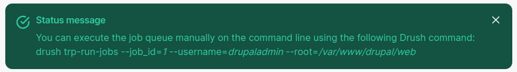
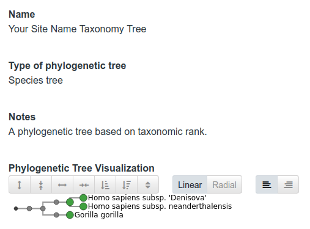

Phylogenetic Tress
====================

A phylogenetic tree, also known as a phylogeny, is a representation of relationships between biological entities.
These entities could be different species, or germplasm accessions within a species.
These entities could also be nucleotide sequences, and the tree might express how multiple copies of a gene are related to each other.

A phylogenetic tree as it is stored in Chado consists of a tree record in the `phylotree` table,
and multiple node records in the `phylonode` table.
The tree record assigns a name to the tree, and links it to a database reference.
Optionally it can also be linked to an analysis.
If desired, any other metadata information can also be included.

Creating Phylogenetic Trees
============================

There are two ways to create phylogenetic trees that are provided by Tripal,
and two types of content used to present these trees to a site user.

Creating a Taxonomy or Species Tree
-------------------------------------

The first of the two content types provided is a Taxonomy or "Species Tree".
This tree type expresses taxonomic relationships between organisms, and can be used to display
a tree of the various organisms present on a Tripal site.

Importing Organism Lineage
^^^^^^^^^^^^^^^^^^^^^^^^^^^^

The organisms on your site need to have been previously prepared using the **Taxonomy Importer**
in order to have the lineage properties imported from the NCBI taxonomy in place.

For example, go to **Tripal** → **Data Loaders** → **NCBI Taxonomy Loader**

In the **NCBI Taxonomy IDs** field entere these four organisms ``9593 9606 63221 741158``

Click the **Import Organisms** button.

A drush command will be given to you. Run this command on the command line.
The actual command will be different than the example command shown here.

Now you can generate the tree with the **Taxonomy Tree Generator** importer.
To run this importer, go to
**Tripal** → **Data Loaders** → **Taxonomy Tree Generator**

Supply a name for your tree, and an optional root taxon, such as the family your site organisms are members of.
The purpose of supplying the root taxon is to simplify the tree base. By default, nodes will created
all the way back to the root node "cellular organisms".

.. image:: phylotrees.4.taxonomy-tree-generator.png
      :alt: Form for generating a taxonomy tree
      :class: image-with-border

Click the **Generate Taxonomy Tree** button,
and then run the job on the command line using the command presented on the screen.

You may then go to **Tripal** → **Content** and click on your tree.
For this example, it will appear as

Creating a Phylotree
----------------------

The Phylotree content type is used for all trees that are not taxonomic trees,
and is a content type defined by the Genomic type collection.

Import the Genomic Content Types Collection
^^^^^^^^^^^^^^^^^^^^^^^^^^^^^^^^^^^^^^^^^^^^^

If you have not yet done so, import the **Genomic Content Types** collection as follows:

Navigate to **Tripal** → **Page Structure** and click the "+ Import type collection" button

Select the **Genomic Content Types** collection

.. image:: phylotrees.6.import-genomic.png
      :alt: Checkbox is checked for the Genomic type collection

A drush command will be given to you. Run this command on the command line.
The actual command will be different than the example command shown here.

Importing a Newick File
^^^^^^^^^^^^^^^^^^^^^^^^^

The Newick file format is a simple, text-based standard for representing phylogenetic trees
using nested parentheses, commas, and semicolons.
It represents relationships between organisms or sequences, with parentheses grouping
related nodes and commas separating them.

Tripal supports importing of trees in the Newick format using a Chado importer.
To do so, navigate to **Tripal** → **Data Loaders** → **Newick Tree Loader**.

.. note::

  You will need to create an analysis before you can import a Newick file.
  Why specify an analysis for a data load? All data comes from some place,
  even if downloaded from a website. By specifying analysis details for all
  data imports it provides provenance and helps end user to reproduce
  the data set if needed. At a minimum it indicates the source of the data. 

