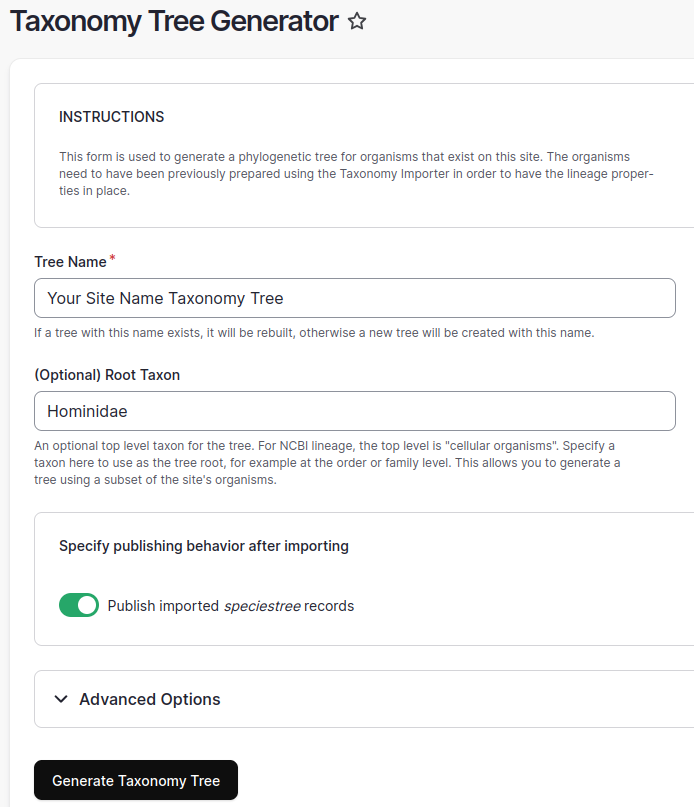
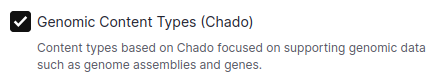
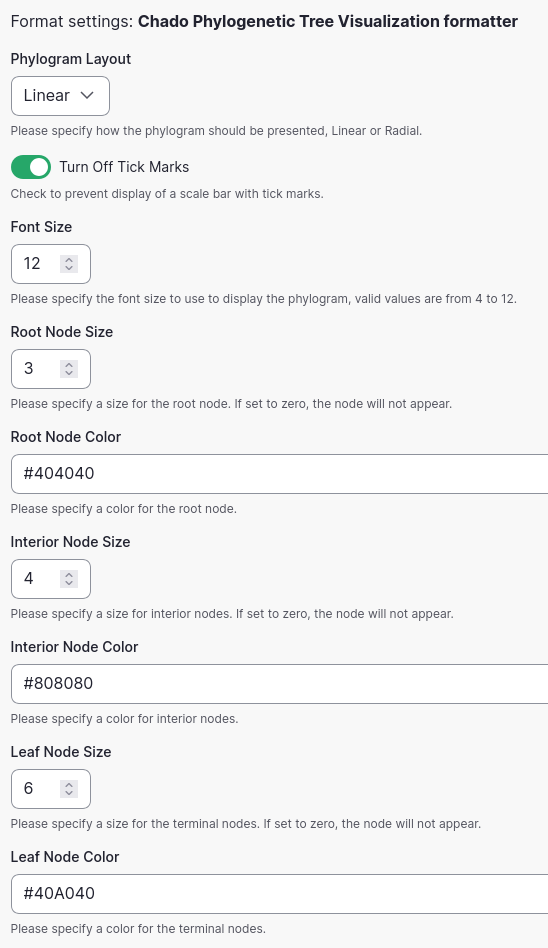
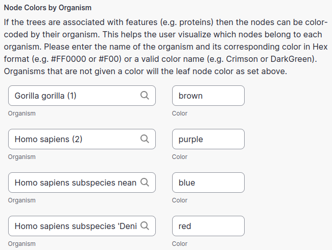
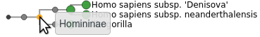
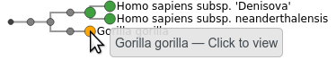
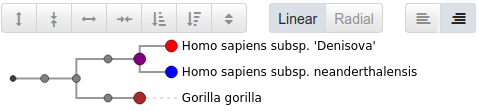

Phylogenetic Trees
====================

A phylogenetic tree, also known as a phylogeny, is a representation of relationships between biological entities.
These entities could be different species, or germplasm accessions within a species.
These entities could also be nucleotide sequences, and the tree might express how multiple copies of a gene are related to each other.

A phylogenetic tree as it is stored in Chado consists of a tree record in the `phylotree` table,
and multiple node records in the `phylonode` table.
The tree record assigns a name to the tree, and links it to a database reference.
Optionally it can also be linked to an analysis.
If desired, any other metadata information can also be included.

There are two ways to create phylogenetic trees that are provided by Tripal,
and two types of content used to present these trees to a site user.
Tree visualization is provided by the `phylotree.js library <https://github.com/veg/phylotree.js/>`_
which extends the `D3 javascript library <https://d3js.org/>`_.

1. Creating a Taxonomy or Species Tree
----------------------------------------

The first of the two content types provided is a Taxonomy or "Species Tree".
This tree type expresses taxonomic relationships between organisms, and can be used to display
a tree of the various organisms present on a Tripal site.

Importing Organism Lineage
^^^^^^^^^^^^^^^^^^^^^^^^^^^^

The organisms on your site need to have been previously prepared using the **Taxonomy Importer**
in order to have the lineage properties imported from the NCBI taxonomy in place.

For example, go to **Tripal** → **Data Loaders** → **NCBI Taxonomy Loader**

In the **NCBI Taxonomy IDs** field entere these four organisms ``9593 9606 63221 741158``

Click the **Import Organisms** button.

A drush command will be given to you. Run this command on the command line.
The actual command will be different than the example command shown here.

.. image:: phylotrees.1.drush-command.png
      :alt: Example drush command

Now you can generate the tree with the **Taxonomy Tree Generator** importer.
To run this importer, go to
**Tripal** → **Data Loaders** → **Taxonomy Tree Generator**

Supply a name for your tree, and an optional root taxon, such as the family your site organisms are members of.
The purpose of supplying the root taxon is to simplify the tree base. By default, nodes will created
all the way back to the root node "cellular organisms".

Click the **Generate Taxonomy Tree** button,
and then run the job on the command line using the command presented on the screen.

You may then go to **Tripal** → **Content** and click on your tree.
For this example, it will appear as

.. image:: phylotrees.3.example-tree.png
      :alt: Appearance of the taxonomy tree with the example organisms
      :class: image-with-border

2. Creating a Phylotree
-------------------------

The Phylotree content type a general purpose content type used for all trees that are not taxonomic trees.
This content type is defined by the Genomic type collection.

Import the Genomic Content Types Collection
^^^^^^^^^^^^^^^^^^^^^^^^^^^^^^^^^^^^^^^^^^^^^

If you have not yet done so, import the **Genomic Content Types** collection as follows:

Navigate to **Tripal** → **Page Structure** and click the "+ Import type collection" button

.. image:: phylotrees.4.import-type-collection.png
      :alt: Appearance of the Import type collection button
      :scale: 75%

Select the **Genomic Content Types** collection

A drush command will be given to you. Run this command on the command line.
The actual command will be different than the example command shown here.

.. image:: phylotrees.1.drush-command.png
      :alt: Example drush command

Importing a Newick File
^^^^^^^^^^^^^^^^^^^^^^^^^

The Newick file format is a simple, text-based standard for representing phylogenetic trees
using nested parentheses, commas, and semicolons.
It represents relationships between organisms or sequences, with parentheses grouping
related nodes and commas separating them.

Tripal supports importing of trees in the Newick format using a Chado importer,
and supports linking nodes in the tree to features or organisms on your site.

To import a new phylotree from a Newick file, navigate to
**Tripal** → **Data Loaders** → **Newick Tree Loader**.

.. note::

  You will need to create an analysis before you can import a Newick file.
  Why specify an analysis for a data load? All data comes from some place,
  even if downloaded from a website. By specifying analysis details for all
  data imports it provides provenance and helps end users to reproduce
  the data set if needed. At a minimum it indicates the source of the data. 

On the import form you will need to specify the source of the Newick file, the analysis, and a tree name.

For the **Tree Type** you will need to specify a controlled vocabulary term.
For example, trees derived from protein sequences should use the sequence ontology term `polypeptide (SO:0000104)`.

If the tree is derived from an online repository, you should link to it using the **Database Cross-Reference** field.

.. warning::

  Tripal 4 has not yet upgraded the ability to add new databases through the admin user interface,
  see issue https://github.com/tripal/tripal/issues/2196 for current status.

The **Feature Name Regular Expression** value is important to correctly link nodes in the imported tree
to existing features or organisms on your site.

The tree nodes will be automatically associated with features, or in the case of taxonomic trees, with organisms.
However, if the nodes in the tree file are not exactly as the names of features or organisms,
but have enough information to uniquely identify them, then you may provide a regular expression
that the importer will use to extract the appropriate names from the node names.

For example, if every node has a prefix referencing a database accession such as `S1234_`
you could use as an expression either: `^S1234_(.*)$ ` or simply `S1234_(.*)`.

Alternatively, the node name may include information after the feature or organism name, for example:

`Tripalus databasica` Bogus. (Fak.)

and you could remove that extra information with: ``^(\S+ \S+).*`` but be careful if there are subspecies!
In complicated situations you may need to preprocess your Newick file first.

.. hint::

  If your import did not link correctly, you can delete the imported tree and try again!
  Use the **Delete** option on the phylotree page.

  .. image:: phylotrees.6.delete.png
        :alt: Selecting the delete button
        :scale: 75%

Configuring Tree Display
--------------------------

Tree Display Content Type Settings
^^^^^^^^^^^^^^^^^^^^^^^^^^^^^^^^^^^^

Size and colors of nodes can be configured by a site administrator as desired. To do so, navigate to
**Tripal** → **Page Structure** and for either **Species Tree** or **Phylogenetic Tree**
select the **Manage display** option.

There on the **Phylogenetic Tree Visualization** field, you will find a settings gear on the right side.
Click the gear to change any of these settings.

Some sites have desired to use custom coloring for organisms.
You can configure specific colors for each site organism on this form in the last section.
Here is an example of setting colors either by name or by hex value.

And here is the appearance of the configured tree.

Tree Display End-user Options
^^^^^^^^^^^^^^^^^^^^^^^^^^^^^^^

A mouseover on a node will display the node name for internal nodes.

For any node linked to content on your site, whether internal or leaf nodes,
a mouse click will open the linked content.

A user of your site has the ability to make some changes to the tree display.
These are made with the row of buttons over the tree.
A mouseover of the button will display an explanation of what it does.
Here a site user has expanded the tree and aligned labels.

