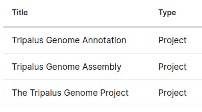
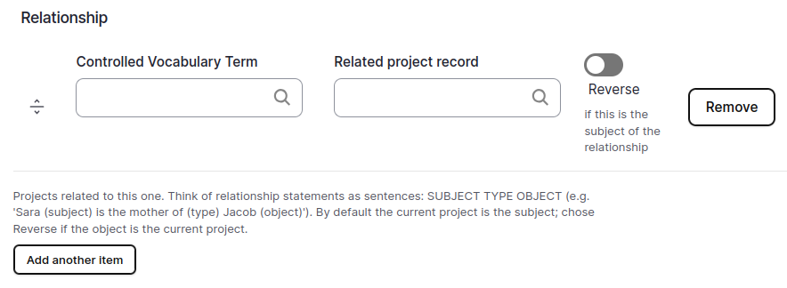
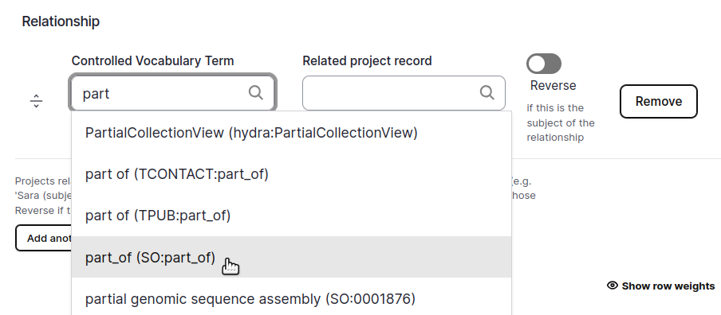
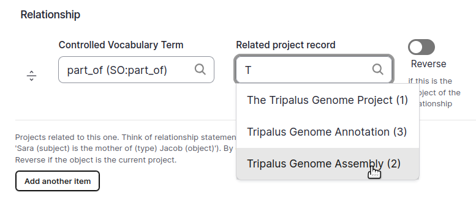
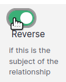
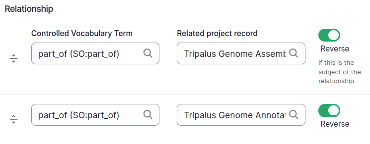
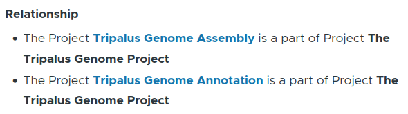
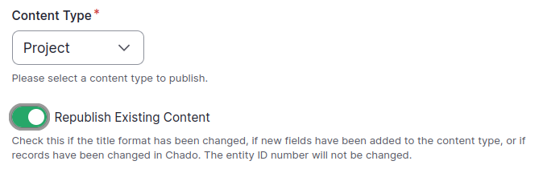
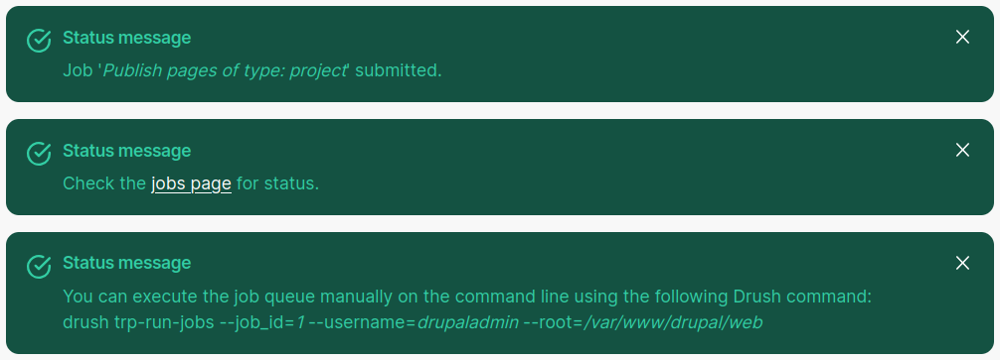
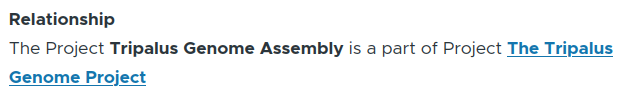

Relationships between content
===============================

Content on your tripal site is almost always related in some way to other types of content.
A *publication* may be about a particular *organism*, or a *project* may consist of several *analyses*.
In other cases, however, the relationship may be between records of the same type of content.
For example, a *chapter* is a part of a *book*, and these are both types of *publication* content.
Similarly, an *exon* may be part of a *gene*, which both are sequence *features*.
A *project* may be part of a larger *umbrella project*.

These types of relationships can be stored in Chado using one of the *relationship* tables.
These relationships are then presented to site users using the relationship field.

How to create a new relationship
----------------------------------

Through the Tripal user interface, you can specify one or more relationships between similar types of content.
When specifying a relationship, a controlled vocabulary term is used to specify how the
records are related.

Let's examine an example where we have a high-level umbrella project which
has two smaller projects that are a part of it.

First we create the three project records.
We have created "The Tripalus Genome Project" which will be the umbrella project,
and two other projects, an assembly and an annotation project.

If we edit the umbrella project "The Tripalus Genome Project",
we will find the relationship field section, which is currently blank.

First we select a controlled vocabulary term which indicates the type of relationship.
Here we are selecting *part_of*, because the two other projects will be *part of* this umbrella project.

Next we select the related project

Then we toggle *reverse* because the selected project *Tripalus Genome Assembly* is the **subject**,
meaning the selected project is the *subject* of the *part of* relationship,
and the *object* is the project that we are currently editing.

We can add a second relationship by clicking the *Add another item* button.

After we add the second relationship, the form looks like this, and we can click the "Save" button.

After saving, the relationships will appear like this.

The relationships will not yet appear on the other two projects.
We need to republish for that to happen.

Go to Tripal → Content → + Publish Tripal Content.

For *Content Type* select *Project*, and make sure to check *Republish Existing Content*.

When this is done, you will see the command you need to run to run the publish job.
It will be different from the one shown here.

Now on the other two projects you will also see the relationship.

.. hint::
    You can also run the republish job on the command line using drush.
    For the project content type, the command would be:

    ``drush trp-chado-publish project --republish``
